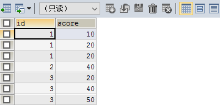
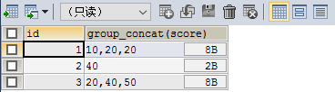
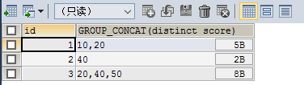
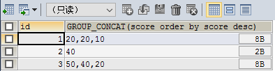
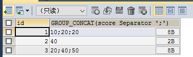

## group_concat

### 完整语法如下

~~~sql
group_concat([DISTINCT] 要连接的字段 [Order BY ASC/DESC 排序字段] [Separator '分隔符'])
~~~

~~~sql
SELECT * FROM testgroup
~~~

表结构与数据如上

现在的需求就是每个id为一行 在前台每行显示该id所有分数

group_concat 上场！！！

~~~sql
SELECT id,GROUP_CONCAT(score) FROM testgroup GROUP BY id
~~~

去重

~~~sql
SELECT id,GROUP_CONCAT(DISTINCT score) FROM testgroup GROUP BY id
~~~

排序

~~~sql
SELECT id,GROUP_CONCAT(score ORDER BY score DESC) FROM testgroup GROUP BY id
~~~

最后可以设置分隔符

~~~sql
SELECT id,GROUP_CONCAT(score SEPARATOR ';') FROM testgroup GROUP BY id
~~~

这样我们的数据就根据id 不同分隔符 放在了一行 前台可以根绝对应的分隔符 对score 字段进行分割 但是有可能存在score 数据类型过大问题

~~~
GROUP_CONCAT()函数可以将多条记录的同一字段的值，拼接成一条记录返回。但是默认情况下，这个拼接最大长度是有限制的，导致结果不完整。

可以使用sql查询最大长度：
show variables like 'group_concat_max_len';

修改最大长度：
SET GLOBAL group_concat_max_len = 4294967295;
SET SESSION group_concat_max_len = 4294967295;
~~~

---

参考链接

1. https://www.cnblogs.com/xphhh/p/11654639.html