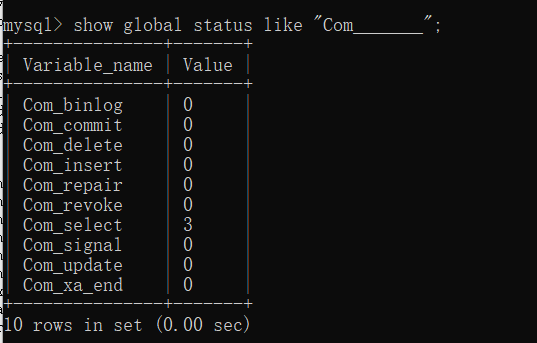
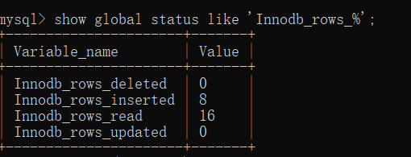
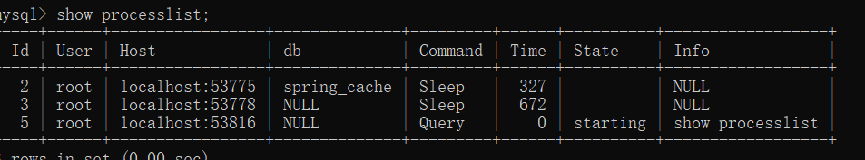

# Mysql高级

### 1.查看sql执行频率

~~~sql
show globla status like "Com________";
-- 查看数据库连接的查询次数。可以知道当前数据库的查询多还是插入多，更新多。
~~~

~~~sql
show global status like 'Innodb_rows_%';
-- 查看innodb数据库引擎查询次数
~~~

### 2.定位低效的sql

#### 2.1慢查询日志--后面讲解

#### 2.2 show processlist; 能查看到每个客户端的每一条语句

### 3.explain

