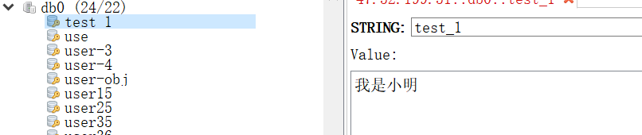
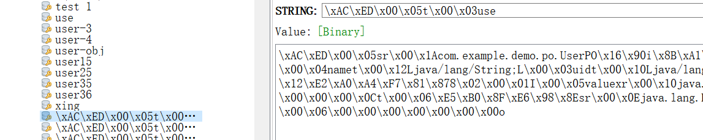
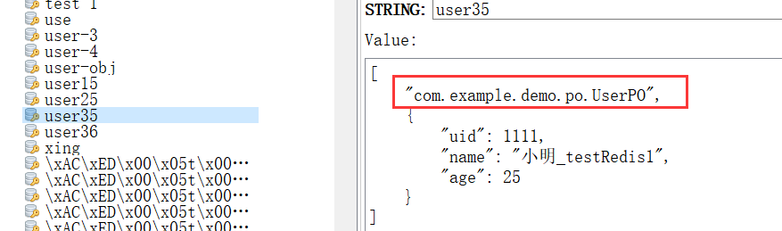

# 1. 为什么要自定义RedisTemplate

我们在代码中，可以完成RedisTemplate的注入，而实际上，我们只是单纯的配置了yml文件，在哪里创建了redisTemplate这个bean对象呢？

**redisTemplate自动装配的源码：**

```java
@Configuration
@ConditionalOnClass(RedisOperations.class)
@EnableConfigurationProperties(RedisProperties.class)
@Import({ LettuceConnectionConfiguration.class, JedisConnectionConfiguration.class })
public class RedisAutoConfiguration {

    @Bean
    @ConditionalOnMissingBean(name = "redisTemplate")
    public RedisTemplate<Object, Object> redisTemplate(RedisConnectionFactory redisConnectionFactory)
            throws UnknownHostException {
        RedisTemplate<Object, Object> template = new RedisTemplate<>();
        template.setConnectionFactory(redisConnectionFactory);
        return template;
    }

    @Bean
    @ConditionalOnMissingBean
    public StringRedisTemplate stringRedisTemplate(RedisConnectionFactory redisConnectionFactory)
            throws UnknownHostException {
        StringRedisTemplate template = new StringRedisTemplate();
        template.setConnectionFactory(redisConnectionFactory);
        return template;
    }

}
```

通过源码可以看出，SpringBoot自动帮我们在容器中生成了一个**RedisTemplate**和一个**StringRedisTemplate**。

1. RedisTemplate的泛型是<Object,Object>，写代码不是很方便，一般我们的key是String类型，我们需要一个<String,Object>的泛型。
2. RedisTemplate没有设置数据存储在Redis时，Key和Value的序列化方式。（采用默认的JDK序列化方式）

**如何优雅的解决上述两个问题呢？**

> **`@ConditionalOnMissing注解`**：如果Spring容器中已经定义了id为redisTemplate的Bean，那么自动装配的RedisTemplate不会实例化。因此我们可以写一个配置类，配置Redisemplate。

若未自定义RedisTemplate，默认会对key进行jdk序列化。

# 2. 如何自定义RedisTemplate

### 2.1 Redis数据的序列化问题

针对StringRedisSerializer，Jackson2JsonRedisSerializer和JdkSerializationRedisSerializer进行测试

| 数据结构  | 序列化类                        | 序列化前   | 序列化后          |
| :-------- | :------------------------------ | :--------- | :---------------- |
| Key/Value | StringRedisSerializer           | test_value | test_value        |
| Key/Value | Jackson2JsonRedisSerializer     | test_value | "test_value"      |
| Key/Value | JdkSerializationRedisSerializer | test_value | 乱码              |
| Hash      | StringRedisSerializer           | 2016-08-18 | 2016-08-18        |
| Hash      | Jackson2JsonRedisSerializer     | 2016-08-18 | "2016-08-18"      |
| Hash      | JdkSerializationRedisSerializer | 2016-08-18 | \xAC\xED\x00\x05t |

**由此可以得到结论：**

1. StringRedisSerializer进行序列化后的值，在Java和Redis中保存的内容时一致的。
2. 用Jackson2JsonRedisSerializer序列化后，在Redis中保存的内容，比Java中多一对逗号。
3. 用JdkSerializationRedisSerializer序列化后，对于Key-Value结构来说，在Redis中不可读；对于Hash的Value来说，比Java的内容多了一些字符。

**自定义的redisTemplate实例：**

```cpp
@Configuration
public class RedisConfig {
    /**
     * 由于原生的redis自动装配，在存储key和value时，没有设置序列化方式，故自己创建redisTemplate实例
     * @param factory
     * @return
     */
    @Bean
    public RedisTemplate<String, Object> redisTemplate(RedisConnectionFactory factory) {
        RedisTemplate<String, Object> template = new RedisTemplate<>();
        template.setConnectionFactory(factory);
        Jackson2JsonRedisSerializer jackson2JsonRedisSerializer = new Jackson2JsonRedisSerializer(Object.class);
        ObjectMapper om = new ObjectMapper();
        om.setVisibility(PropertyAccessor.ALL, JsonAutoDetect.Visibility.ANY);
        om.enableDefaultTyping(ObjectMapper.DefaultTyping.NON_FINAL);
        jackson2JsonRedisSerializer.setObjectMapper(om);
        StringRedisSerializer stringRedisSerializer = new StringRedisSerializer();
        // key采用String的序列化方式
        template.setKeySerializer(stringRedisSerializer);
        // hash的key也采用String的序列化方式
        template.setHashKeySerializer(stringRedisSerializer);
        // value序列化方式采用jackson
        template.setValueSerializer(jackson2JsonRedisSerializer);
        // hash的value序列化方式采用jackson
        template.setHashValueSerializer(jackson2JsonRedisSerializer);
        template.afterPropertiesSet();
        return template;
    }
}
```

**对于Key来说，我们采用stringRedisSerializer。而对于Value来我们采用jackson2JsonRedisSerializer的序列化方式。**

---

# 3.redisTemplate和stringRedisTemplate对比

### 1、StringRedisTemplate

- 主要用来存储字符串，StringRedisSerializer的泛型指定的是String。当存入对象时，会报错 ：can not cast into String。
- 可见性强，更易维护。如果过都是字符串存储可考虑用StringRedisTemplate。




### 2、RedisTemplate

- 可以用来存储对象，但是要实现Serializable接口。
- 以二进制数组方式存储，内容没有可读性。




# 4.redisTemplate序列化方式比较

那有没有办法，可以序列化对象，可读性又强呢？

- 1、手动转化成json串再存储。取出数据需要反序列化。
- 2、使用其他序列化方式。

spring-data-redis提供如下几种选择：

- GenericToStringSerializer: 可以将任何对象泛化为字符串并序列化
- Jackson2JsonRedisSerializer: 跟JacksonJsonRedisSerializer实际上是一样的
- JacksonJsonRedisSerializer: 序列化object对象为json字符串
- JdkSerializationRedisSerializer: 序列化java对象
- StringRedisSerializer: 简单的字符串序列化


### 1、性能测试对比

```java
@Test
    public void testSerial(){
        UserPO userPO = new UserPO(1111L,"小明_testRedis1",25);
        List<Object> list = new ArrayList<>();
        for(int i=0;i<200;i++){
            list.add(userPO);
        }
        JdkSerializationRedisSerializer j = new JdkSerializationRedisSerializer();
        GenericJackson2JsonRedisSerializer g = new GenericJackson2JsonRedisSerializer();
        Jackson2JsonRedisSerializer j2 = new Jackson2JsonRedisSerializer(List.class);


        Long j_s_start = System.currentTimeMillis();
        byte[] bytesJ = j.serialize(list);
        System.out.println("JdkSerializationRedisSerializer序列化时间："+(System.currentTimeMillis()-j_s_start) + "ms,序列化后的长度：" + bytesJ.length);
        Long j_d_start = System.currentTimeMillis();
        j.deserialize(bytesJ);
        System.out.println("JdkSerializationRedisSerializer反序列化时间："+(System.currentTimeMillis()-j_d_start));


        Long g_s_start = System.currentTimeMillis();
        byte[] bytesG = g.serialize(list);
        System.out.println("GenericJackson2JsonRedisSerializer序列化时间："+(System.currentTimeMillis()-g_s_start) + "ms,序列化后的长度：" + bytesG.length);
        Long g_d_start = System.currentTimeMillis();
        g.deserialize(bytesG);
        System.out.println("GenericJackson2JsonRedisSerializer反序列化时间："+(System.currentTimeMillis()-g_d_start));

        Long j2_s_start = System.currentTimeMillis();
        byte[] bytesJ2 = j2.serialize(list);
        System.out.println("Jackson2JsonRedisSerializer序列化时间："+(System.currentTimeMillis()-j2_s_start) + "ms,序列化后的长度：" + bytesJ2.length);
        Long j2_d_start = System.currentTimeMillis();
        j2.deserialize(bytesJ2);
        System.out.println("Jackson2JsonRedisSerializer反序列化时间："+(System.currentTimeMillis()-j2_d_start));
    }
```


结果：

JdkSerializationRedisSerializer序列化时间：8ms,序列化后的长度：1325
JdkSerializationRedisSerializer反序列化时间：4
GenericJackson2JsonRedisSerializer序列化时间：52ms,序列化后的长度：17425
GenericJackson2JsonRedisSerializer反序列化时间：60
Jackson2JsonRedisSerializer序列化时间：4ms,序列化后的长度：9801
Jackson2JsonRedisSerializer反序列化时间：4


### 2、性能总结

- JdkSerializationRedisSerializer序列化后长度最小，Jackson2JsonRedisSerializer效率最高。
- 如果综合考虑效率和可读性，牺牲部分空间，推荐key使用StringRedisSerializer，保持的key简明易读；value可以使用Jackson2JsonRedisSerializer
- 如果空间比较敏感，效率要求不高，推荐key使用StringRedisSerializer，保持的key简明易读；value可以使用JdkSerializationRedisSerializer


### 3、方案一、考虑效率和可读性，牺牲部分空间

```java
package com.example.demo.config.redisConfig;

import com.fasterxml.jackson.annotation.JsonAutoDetect;
import com.fasterxml.jackson.annotation.PropertyAccessor;
import com.fasterxml.jackson.databind.ObjectMapper;
import org.springframework.context.annotation.Bean;
import org.springframework.context.annotation.Configuration;
import org.springframework.data.redis.connection.RedisConnectionFactory;
import org.springframework.data.redis.core.RedisTemplate;
import org.springframework.data.redis.serializer.Jackson2JsonRedisSerializer;
import org.springframework.data.redis.serializer.StringRedisSerializer;

@Configuration
public class RedisConfig {
    @Bean(name = "redisTemplate")
    public RedisTemplate<String, Object> getRedisTemplate(RedisConnectionFactory factory) {
        RedisTemplate<String, Object> redisTemplate = new RedisTemplate<String, Object>();
        redisTemplate.setConnectionFactory(factory);
        redisTemplate.setKeySerializer(new StringRedisSerializer()); // key的序列化类型

        Jackson2JsonRedisSerializer jackson2JsonRedisSerializer = new Jackson2JsonRedisSerializer(Object.class);
        ObjectMapper objectMapper = new ObjectMapper();
        objectMapper.setVisibility(PropertyAccessor.ALL, JsonAutoDetect.Visibility.ANY);
        objectMapper.enableDefaultTyping(ObjectMapper.DefaultTyping.NON_FINAL);

        jackson2JsonRedisSerializer.setObjectMapper(objectMapper);
        redisTemplate.setValueSerializer(jackson2JsonRedisSerializer); // value的序列化类型
        return redisTemplate;
    }
}
```


注： new Jackson2JsonRedisSerializer(Object.class)需要指明类型，例如：new Jackson2JsonRedisSerializer(User.class)，否则会报错：

java.lang.ClassCastException: java.util.LinkedHashMap cannot be cast to com.example.demo.bean.User。

或者开启默认类型：

 

```java
 ObjectMapper objectMapper = new ObjectMapper();
 objectMapper.setVisibility(PropertyAccessor.ALL, JsonAutoDetect.Visibility.ANY);
 objectMapper.enableDefaultTyping(ObjectMapper.DefaultTyping.NON_FINAL);
 jackson2JsonRedisSerializer.setObjectMapper(objectMapper);
```

 

这种方式存储时会自动带上类的全路径，占用部分空间：



 

### 4、方案二、空间敏感，忽略可读性和效率影响

```java
@Configuration
public class RedisConfig {
    @Bean(name = "redisTemplate")
    public RedisTemplate<String, Object> getRedisTemplate(RedisConnectionFactory factory) {
        RedisTemplate<String, Object> redisTemplate = new RedisTemplate<String, Object>();
        redisTemplate.setConnectionFactory(factory);
        redisTemplate.setKeySerializer(new StringRedisSerializer()); // key的序列化类型
        redisTemplate.setValueSerializer(new JdkSerializationRedisSerializer()); // value的序列化类型
        return redisTemplate;
    }
}
```


注：该方式，对象需要实现接口：Serializable


### 5、使用示例


```java
@RunWith(SpringRunner.class)
@SpringBootTest
@WebAppConfiguration
public class RedisTest {
    @Resource
    private RedisTemplate redisTemplate;

    @Test
    public void testRedis1(){
        User user = new User();
        user.setAge(11);
        user.setName("我是小王1");
        redisTemplate.opsForValue().set("user37",user);
        System.out.println(redisTemplate.getValueSerializer());
        System.out.println(redisTemplate.getKeySerializer());
        User result = (User) redisTemplate.opsForValue().get("user37");
        System.out.println(result);
    }
}
```


# 5.spring-data-redis中提供的序列化方式：

JdkSerializationRedisSerializer：序列化java对象。RestTemplate类默认的序列化方式。

~~~
反序列化时不需要提供（传入）类型信息(class)。
存储的对象需实现Serializable接口，比较笨重。
序列化为二进制数据，这对开发者是不友好的。
序列化后的结果非常庞大，是JSON格式的5倍左右
~~~

OxmSerializer：以xml格式存储（但还是String类型~）

~~~
解析起来也比较复杂，效率也比较低
~~~

StringRedisSerializer：简单的字符串序列化。StringRedIsTemplate的默认序列化方式，KV均采用此方式序列化。

~~~
对开发者友好。轻量级。效率高。
~~~

GenericToStringSerializer：可以将任何对象泛化为字符创并序列化。

~~~
需要调用者给传一个对象到字符串互转的Converter（相当于转换为字符串的操作交给转换器去做)
~~~

Jackson2JsonRedisSerializer：序列化Object对象为json字符串（与JacksonJsonRedisSerializer相同）

~~~
不需要实现 Serializable接口。
速度快，序列化后的字符串短小精悍。
没有@class信息，所以只要字段名相同即可。只要你指定了类型，就能反序列化成功。
缺点：必须提供要序列化对象的类型信息(.class对象)
~~~

GenericJackson2JsonRedisSerializer：和Jackson2JsonRedisSerializer相近。

~~~
不用自己手动指定对象的Class。
序列化后的内容存储了@class信息。不能序列化和反序列化不同包路径的对象
~~~

# 6.redis整合配置

~~~markdown
- 1.现阶段构建springboot项目时，优先使用springboot2进行构建
- 2.创建RedisConfig配置类，为其中注入 RedisTemplate 和 StringRedisTemplate 对象。redisTempalte 的key和value可以使用StringRedisSerializer进行设置。（注入对象那个的时候，好像只需要注入Object类型的模板就行，在Springboot2中无需对某个单独对象设置模板，只需要某个单独对象的cacheManager对象就行）
- 3.创建RedisCacheManager对象进行注入
	
~~~


### 1.RedisCacheManager对象

~~~java
/**
     * 基于SpringBoot2 对 RedisCacheManager 的自定义配置
     * @param redisConnectionFactory
     * @return
     */
    @Primary
    @Bean
    public RedisCacheManager emptCacheManager(RedisConnectionFactory redisConnectionFactory) {
        //初始化一个RedisCacheWriter
        RedisCacheWriter redisCacheWriter = RedisCacheWriter.nonLockingRedisCacheWriter(redisConnectionFactory);
        //设置CacheManager的值序列化方式为json序列化
//        RedisSerializer<Object> jsonSerializer = new GenericJackson2JsonRedisSerializer();// 使用object对象
        RedisSerializer<Employee> jsonSerializer = new Jackson2JsonRedisSerializer<Employee>(Employee.class);

        RedisSerializationContext.SerializationPair<Employee> pair = RedisSerializationContext.SerializationPair.fromSerializer(jsonSerializer);
        RedisCacheConfiguration defaultCacheConfig = RedisCacheConfiguration.defaultCacheConfig().serializeValuesWith(pair);

//        defaultCacheConfig.disableKeyPrefix();// 不使用缓存组件名称作为字段前缀 需放在上一行代码中生效
        //设置默认超过时期是1天
        defaultCacheConfig.entryTtl(Duration.ofHours(1));
        //初始化RedisCacheManager
        return new RedisCacheManager(redisCacheWriter, defaultCacheConfig);
    }
~~~


# 7.常用注解

### 1.注解举例

~~~java
@Cacheable(value = {"emp"},cacheManager = "emptCacheManager",key = "'one:id:'+#a0",unless = "#result == null")
@Cacheable(value = {"emp"},cacheManager = "emptCacheManager",key = "'one:id:'+#a0.id")
~~~


### 2.注解解释

~~~java
/** @Cacheable标注的方法执行之前先来检查缓存中有没有这个数据，默认按照参数的值作为key去查询缓存，
     *   如果没有就运行方法并将结果放入缓存；以后再来调用就可以直接使用缓存中的数据；
     *
     *   核心：
     *      1）、使用CacheManager【ConcurrentMapCacheManager】按照名字得到Cache【ConcurrentMapCache】组件
     *      2）、key使用keyGenerator生成的，默认是SimpleKeyGenerator
     *
     *
     *   几个属性：
     *      cacheNames/value：指定缓存组件的名字;将方法的返回结果放在哪个缓存中，是数组的方式，可以指定多个缓存；
     *
     *      key：缓存数据使用的key；可以用它来指定。默认是使用方法参数的值  1-方法的返回值
     *              编写SpEL； #i d;参数id的值   #a0  #p0  #root.args[0]
     *              getEmp[2]
     *
     *      keyGenerator：key的生成器；可以自己指定key的生成器的组件id
     *              key/keyGenerator：二选一使用;
     *
     *
     *      cacheManager：指定缓存管理器；或者cacheResolver指定获取解析器
     *
     *      condition：指定符合条件的情况下才缓存；
     *              ,condition = "#id>0"
     *          condition = "#a0>1"：第一个参数的值》1的时候才进行缓存
     *
     *      unless:否定缓存；当unless指定的条件为true，方法的返回值就不会被缓存；可以获取到结果进行判断
     *              unless = "#result == null"
     *              unless = "#a0==2":如果第一个参数的值是2，结果不缓存；
     *      sync：是否使用异步模式 异步模式下不支持unless
     */
~~~


## 参考文章

1. 作者：小胖学编程
   链接：https://www.jianshu.com/p/0d4aea41a70c

2. 作者：[跃小云](https://www.cnblogs.com/yuexiaoyun/)

   链接：https://www.cnblogs.com/yuexiaoyun/articles/13033998.html

3. 原文链接：https://blog.csdn.net/piaodinghuo4319/article/details/96426566