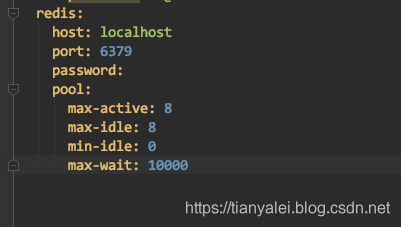
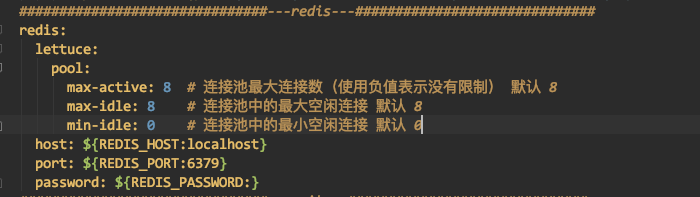
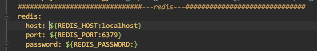
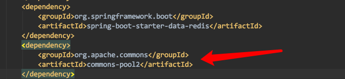
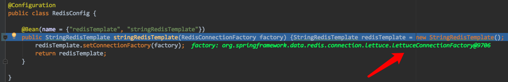
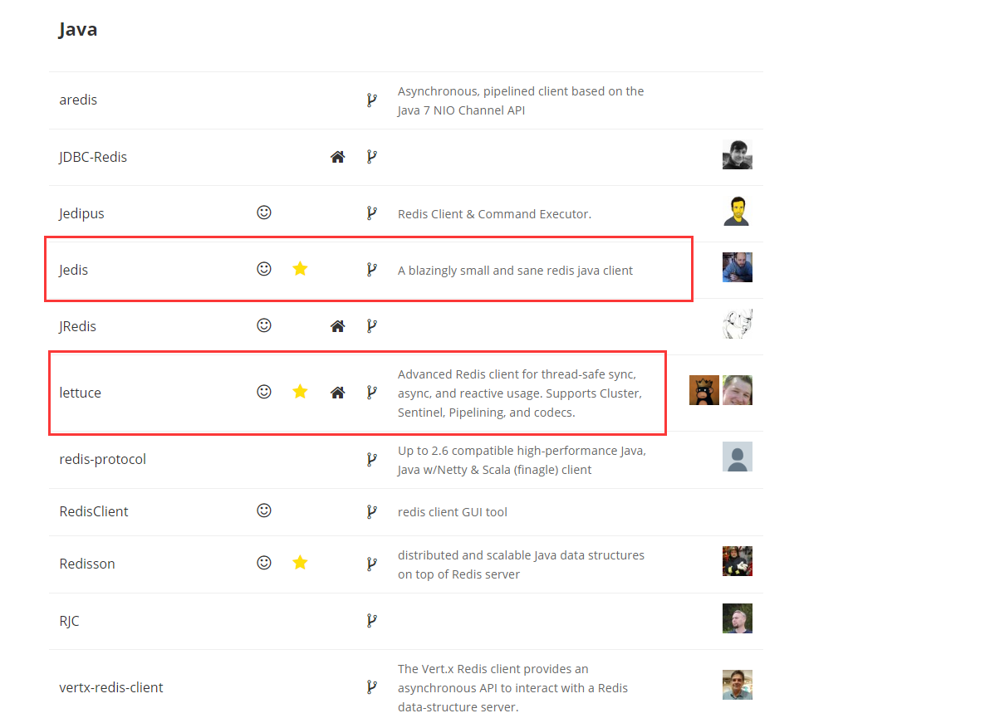
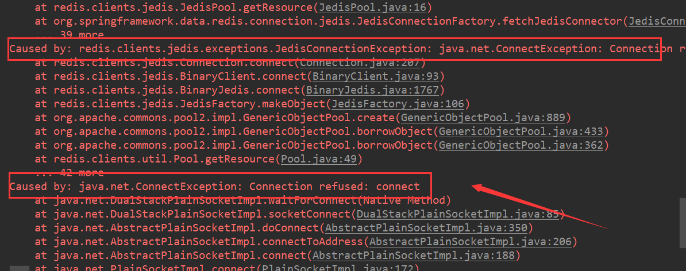

# Redis连接池配置

---

### SpringBoot2集成redis，使用lettuce客户端

Springboot集成redis大家都会用，主要就是使用RedisTemplate类来进行各种操作。可能很多人并没有注意，在Springboot2以后，底层访问redis已经不再是jedis了，而是lettuce。

至于jedis和lettuce有什么区别呢，对我们的使用有什么影响呢？

jedis采用的是直连redis server，在多个线程之间共用一个jedis实例时，是线程不安全的。如果想避免线程不安全，可以使用连接池pool，这样每个线程单独使用一个jedis实例。由此带来的问题时，如果线程数过多，带来redis server的负载加大。有点类似于BIO的模式。

lettuce采用netty连接redis server，实例可以在多个线程间共享，不存在线程不安全的情况，这样可以减少线程数量。当然，在特殊情况下，lettuce也可以使用多个实例。有点类似于NIO的模式。

在配置使用时，其实对我们影响很小。

在Springboot1.x时，我们配置redis是这样的：

那么现在使用了lettuce的情况下：

如果你感觉并不需要这个pool，把pool的配置给去掉就行了：

此时需要一个注意的地方，如果你配置了这个pool，那么必须在pom.xml添加上commons-pool2的依赖。没配置pool的话，可以不引用。

如果要在代码中使用RedisTemplate，那么配完上面的就已经可以用了，不过RedisTemplate默认只能支持RedisTemplate<String,String>形式的，也就是key-value只能是字符串，不能是其他对象。这在我的使用中，已经满足需求了，我都是将需要存入redis的对象变成json字符串存入。

如果你想存入其他类型的数据，就需要如下图，自己定义一个RedisTemplate对象，返回一个自己想要的RedisTemplate对象，自己定义序列化方式。下图可以看到那个factory就是LettuceConnectionFactory。

 

————————————————
版权声明：本文为CSDN博主「天涯泪小武」的原创文章，遵循CC 4.0 BY-SA版权协议，转载请附上原文出处链接及本声明。
原文链接：https://blog.csdn.net/tianyaleixiaowu/article/details/89847286

----

### 连接池介绍

Redis 连接池简介
在后面 springboot 整合 redis 的时候会用到连接池，所以这里先来介绍下 Redis中的连接池:

客户端连接 Redis 使用的是 TCP协议，直连的方式每次需要建立 TCP连接，而连接池的方式是可以预先初始化好客户端连接，所以每次只需要从 连接池借用即可，而借用和归还操作是在本地进行的，只有少量的并发同步开销，远远小于新建TCP连接的开销。另外，直连的方式无法限制 redis客户端对象的个数，在极端情况下可能会造成连接泄漏，而连接池的形式可以有效的保护和控制资源的使用。

下面以Jedis客户端为例，再来总结下 客户端直连方式和连接池方式的对比

 	优点	缺点
直连	简单方便，适用于少量长期连接的场景	1. 存在每次新建/关闭TCP连接开销 2. 资源无法控制，极端情况下出现连接泄漏 3. Jedis对象线程不安全(Lettuce对象是线程安全的)
连接池	1. 无需每次连接生成Jedis对象，降低开销 2. 使用连接池的形式保护和控制资源的使用	相对于直连，使用更加麻烦，尤其在资源的管理上需要很多参数来保证，一旦规划不合理也会出现问题
Jedis vs Lettuce
redis官方提供的java client有如图所示几种：

 

      比较突出的是 Lettuce 和 jedis。Lettuce 和 jedis 的都是连接 Redis Server的客户端，Jedis 在实现上是直连 redis server，多线程环境下非线程安全，除非使用连接池，为每个 redis实例增加 物理连接。
    
      Lettuce 是 一种可伸缩，线程安全，完全非阻塞的Redis客户端，多个线程可以共享一个RedisConnection,它利用Netty NIO 框架来高效地管理多个连接，从而提供了异步和同步数据访问方式，用于构建非阻塞的反应性应用程序。

在 springboot 1.5.x版本的默认的Redis客户端是 Jedis实现的，springboot 2.x版本中默认客户端是用 lettuce实现的。

      Jedis 和 Lettuce 是 Java 操作 Redis 的客户端。在 Spring Boot 1.x 版本默认使用的是 jedis ，而在 Spring Boot 2.x 版本默认使用的就是Lettuce。关于 Jedis 跟 Lettuce 的区别如下：

Jedis在实现上是直接连接的redis server，如果在多线程环境下是非线程安全的，这个时候只有使用连接池，为每个Jedis实例增加物理连接
Lettuce的连接是基于Netty的，连接实例（StatefulRedisConnection）可以在多个线程间并发访问，应为StatefulRedisConnection是线程安全的，所以一个连接实例（StatefulRedisConnection）就可以满足多线程环境下的并发访问，当然这个也是可伸缩的设计，一个连接实例不够的情况也可以按需增加连接实例。

springboot 2.0 通过 jedis 集成Redis服务
导入依赖
      因为 springboot2.0中默认是使用 Lettuce来集成Redis服务，spring-boot-starter-data-redis默认只引入了 Lettuce包，并没有引入 jedis包支持。所以在我们需要手动引入 jedis的包，并排除掉 lettuce的包，pom.xml配置如下:

~~~xml
<dependency>
    <groupId>org.springframework.boot</groupId>
    <artifactId>spring-boot-starter</artifactId>
</dependency>
<dependency>
    <groupId>org.springframework.boot</groupId>
    <artifactId>spring-boot-starter-web</artifactId>
</dependency>
<dependency>
    <groupId>org.springframework.boot</groupId>
    <artifactId>spring-boot-starter-data-redis</artifactId>
    <exclusions>
        <exclusion>
            <groupId>io.lettuce</groupId>
            <artifactId>lettuce-core</artifactId>
        </exclusion>
    </exclusions>
</dependency>
<dependency>
    <groupId>org.springframework.boot</groupId>
    <artifactId>spring-boot-starter-test</artifactId>
    <scope>test</scope>
</dependency>
<dependency>
    <groupId>redis.clients</groupId>
    <artifactId>jedis</artifactId>
</dependency>
~~~

application.properties配置
使用jedis的连接池

~~~properties
spring.redis.host=localhost
spring.redis.port=6379
spring.redis.password=root
spring.redis.jedis.pool.max-idle=8
spring.redis.jedis.pool.max-wait=-1ms
spring.redis.jedis.pool.min-idle=0
spring.redis.jedis.pool.max-active=8
~~~

redis连接失败，springboot2.x通过以上方式集成Redis并不会读取配置文件中的 spring.redis.host等这样的配置，需要手动配置,如下：

~~~java
@Configuration
public class RedisConfig2 {
    @Value("${spring.redis.host}")
    private String host;
    @Value("${spring.redis.port}")
    private int port;
    @Value("${spring.redis.password}")
    private String password;
    @Bean
    public RedisTemplate<String, Serializable> redisTemplate(JedisConnectionFactory connectionFactory) {
        RedisTemplate<String, Serializable> redisTemplate = new RedisTemplate<>();
        redisTemplate.setKeySerializer(new StringRedisSerializer());
        redisTemplate.setValueSerializer(new GenericJackson2JsonRedisSerializer());
        redisTemplate.setConnectionFactory(jedisConnectionFactory());
        return redisTemplate;
    }
    @Bean
    public JedisConnectionFactory jedisConnectionFactory() {
        RedisStandaloneConfiguration config = new RedisStandaloneConfiguration();
        config.setHostName(host);
        config.setPort(port);
        config.setPassword(RedisPassword.of(password));
        JedisConnectionFactory connectionFactory = new JedisConnectionFactory(config);
        return connectionFactory;
    }
}
~~~

————————————————
版权声明：本文为CSDN博主「zzhongcy」的原创文章，遵循CC 4.0 BY-SA版权协议，转载请附上原文出处链接及本声明。
原文链接：https://blog.csdn.net/zzhongcy/article/details/102584028