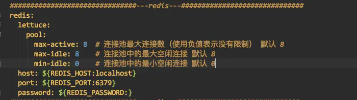

# jedis客户端与lettuce客户端

SpringBoot集成Redis主要是使用RedisTemplate类进行操作，但是在SpringBoot2.0以后，底层访问的不再是Jedis而是lettuce。

> jedis客户端和lettuce客户端的区别

jedis采用的是直连redis server，在多线程之间公用一个jedis实例，是线程不安全的，想要避免线程不安全，可以使用连接池pool，这样每个线程单独使用一个jedis实例，但是线程过多时，带来的是redis server的负载较大。有点类似BIO模式。

lettuce采用netty连接redis server，实例在多个线程间共享，不存在线程不安全的情况，这样可以减少线程数量。当然在特殊情况下，lettuce也可以使用多个实例，有点类似NIO模式。


```xml
 <!--redis默认使用的Lettuce客户端-->  
 <dependency>
    <groupId>org.springframework.boot</groupId>
    <artifactId>spring-boot-starter-data-redis</artifactId>
 </dependency>
 <!--使用默认的Lettuce时，若配置spring.redis.lettuce.pool则必须配置该依赖-->
 <dependency>
    <groupId>org.apache.commons</groupId>
    <artifactId>commons-pool2</artifactId>
 </dependency>
```

需要注意的是，若是在配置中配置了pool属性，那么必须在pom.xml文件中加入commons-pool2的依赖。




作者：小胖学编程
链接：https://www.jianshu.com/p/0d4aea41a70c
来源：简书
著作权归作者所有。商业转载请联系作者获得授权，非商业转载请注明出处。