# Redis

####  1. 版本问题

> 如果安装6.0版本的redis，则需要安装6.0.8
>
> redis最好的性能是linux版本

#### 2. 常用数据类型

~~~
8大类型
  1.String(字符类型)
  2.Hash(散列类型)
  3.List(列表类型)
  4.Set(集合类型)
  5.SortedSet(有序集合类型，简称zset)
  6.Bitmap(位图)
  7.HyperLogLog(统计)
  8.GEO（地理）
  官网命令大全网址
  http://www.redis.cn/commands.html
~~~

>命令不区分大小写，而key是区分大小写的
>
>help @类型名词

##### 2.1 String

~~~
最常用
  set key value
  get key
同时设置/获取多个键值
  MSET key value [key value ....]
  MGET key [key ....]
数值增减
  递增数字
    INCR key
  增加指定的整数
    INCRBY key increment
  递减数值
    DECR key
  减少指定的整数
    DECRBY key decrement
获取字符串长度
  STRLEN key
分布式锁
  setnx key value
  set key value [Ex seconds][PX milliseconds][NX|XX]
~~~

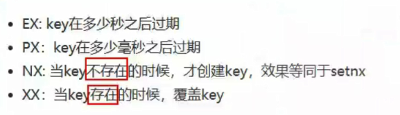

应用场景：

> 商品编号、订单号采用INCR命令生成
>
> 是否喜欢的文章

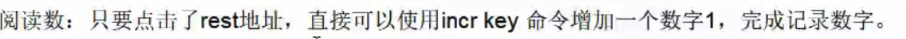

##### 2.2 hash

~~~
redis hash ====>Map<String,Map<String,String>>
~~~

~~~
hash
  Map<String,Map<Object,object>>
  一次设置一个字段值
    HSET key field value
  一次获取一个字段值
    HGET key field
  一次设置多个字段值
    HMSET key field value [field value ...]
  一次获取多个字段值
    HMGETkey field [field ....]
  获取所有字段值
    hgetall key
  获取某个key内的全部数量
    hlen
  删除一个key
    hdel
  应用场景
    购物车早期，当前小中厂可用
~~~

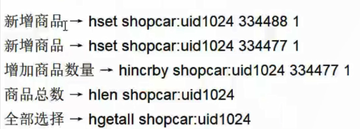

##### 2.3 list

~~~
list
  向列表左边添加元素
    LPUSH key value [value ...]
  向列表右边添加元素
    RPUSH key value [value ....]
  查看列表
    LRANGE key start stop
  获取列表中元素的个数
    LLEN key
  应用场景
    微信文章订阅公众号
~~~

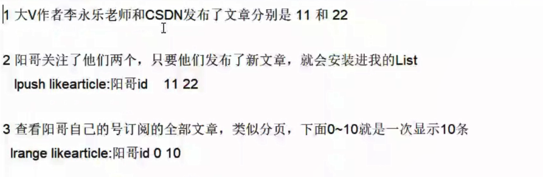

##### 2.4 set

~~~
set
  添加元素
    SADD key member[member ...]
  删除元素
    SREM key member [member ...]
  获取集合中的所有元素
    SMEMBERS key
  判断元素是否在集合中
    SISMEMBER key member
  获取集合中的元素个数
    SCARD key
  从集合中随机弹出一个元素，元素不删除
    SRANDMEMBER key [数字]
  从集合中随机弹出一个元素，出一个删一个
    SPOP key[数字]
  集合运算
    集合的差集运算A-B
      属于A但不属于B的元素构成的集合
      SDIFF key [key ...]
    集合的交集运算A∩B
      属于A同时也属于B的共同拥有的元素构成的集合
      SINTER key [key ...]
    集合的并集运算AUB
      属于A或者属于B的元素合并后的集合
      SUNION key [key ...]
~~~

>   应用场景

###### 微信抽奖小程序

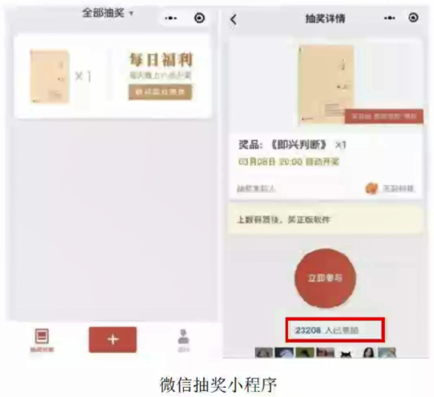

~~~
1 用户ID，立即参与按钮	sadd key 用户ID
2 显示已经有多少人参与了，上图23208人参加	SCARD key
3 抽奖(从set中任意选取N个中奖人)	SRANDMEMBER key 2     随机抽奖2个人，元素不删除
SPOP key3                        随机抽奖3个人，元素会删除
~~~

###### 微信朋友圈点赞

###### 微博好友关注社交关系

共同关注的人

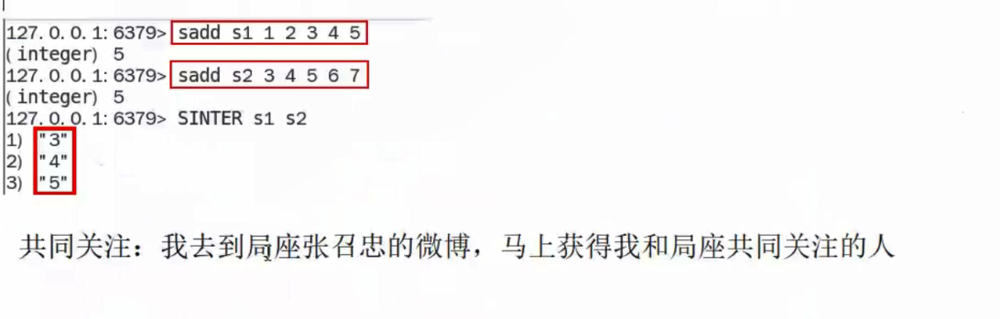

我关注的人也关注他(大家爱好相同)

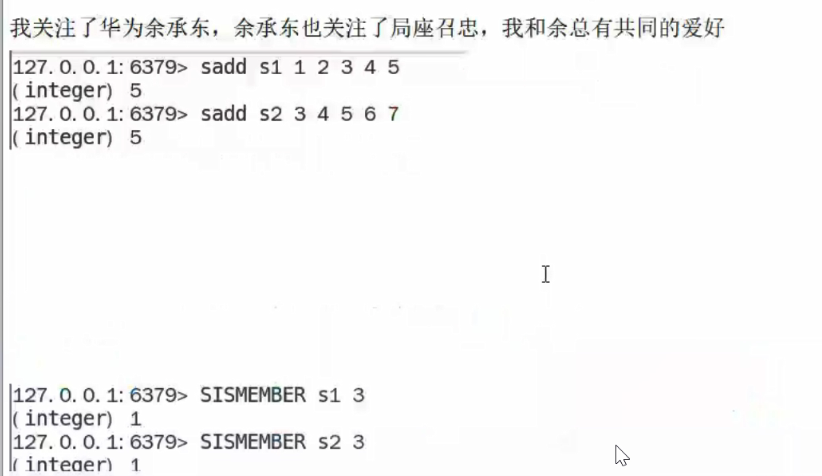

###### QQ内推可能认识的人

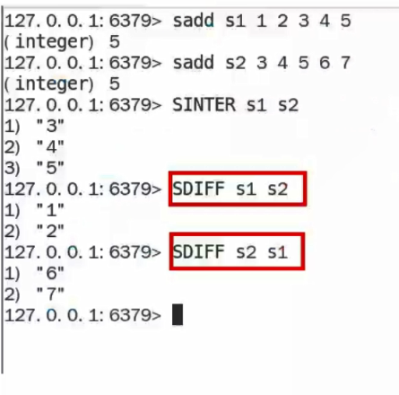

##### 2.5 zset

~~~
zset
  向有序集合中加入一个元素和该元素的分数
  添加元素
    ZADD key score member [score member ...]
  按照元素分数从小到大的顺序 返回索引从start到stop之间的所有元素
    ZRANGE key start stop [WITHSCORES]
  获取元素的分数
     ZSCORE key member
  删除元素
    ZREM key member [member ...]
  获取指定分数范围的元素
    ZRANGEBYsCORE key min max [WITHSCORES] [LIMIT offset count]
  增加某个元素的分数
    ZINCRBY key increment member
  获取集合中元素的数量
    ZCARD key
  获得指定分数范围内的元素个数
    zCOUNT key min max
  按照排名范围删除元素
    ZREMRANGEBYRANK key start stop
  获取元素的排名
    从小到大
      ZRANK key member
    从大到小
      ZREVRANK key member

~~~

>   应用场景

###### 根据商品销售对商品进行排序显示

思路:定义商品销售排行榜(sorted set集合)，key为goods:sellsort，分数为商品销售数量。

商品编号1001的销量是9，商品编号1002的销量是15	zadd goods:sellsort 9 1001 15 1002
有一个客户又买了2件商品1001，商品编号1001销量加2	zincrby goods:sellsort 2 1001
求商品销量前10名	ZRANGE goods:sellsort 0 10 withscores
            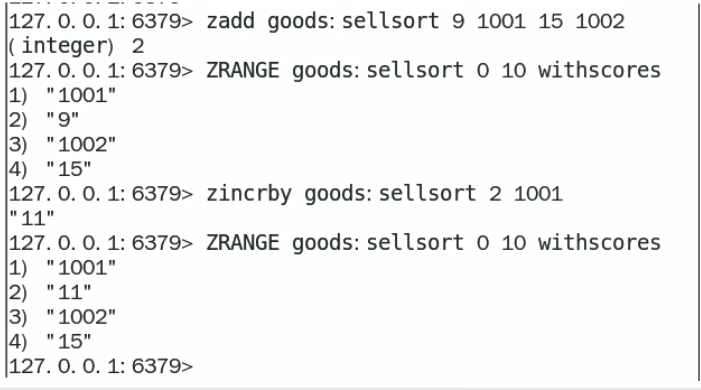                                            

###### 抖音热搜

~~~
1点击视频	
ZINCRBY hotvcr:20200919 1八佰
ZINCRBY hotvcr:20200919 15 八佰 2 花木兰
2 展示当日排行前10条	ZREVRANGE hotvcr:20200919 0 9 withscores
~~~

#### 3. Redis分布式锁

> 分布式锁的面试题

~~~
分布式锁的面试题
  Redis除了拿来做缓存，你还见过基于Redis的什么用法?
  Redis做分布式锁的时候有需要注意的问题?
  如果是Redis是单点部署的，会带来什么问题?
    那你准备怎么解决单点问题呢?
  集群模式下，比如主从模式，有没有什么问题呢?
  那你简单的介绍一下Redlock吧?你简历上写redisson，你谈谈
  Redis分布式锁如何续期?看门狗知道吗?
~~~

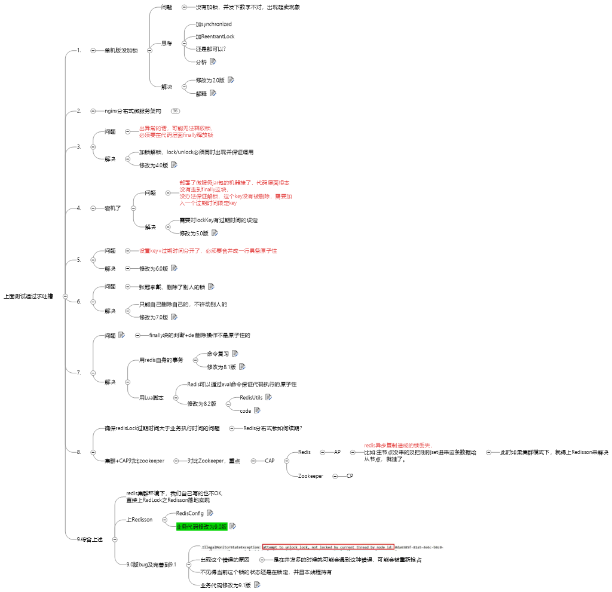

##### 3.1 单机版没有锁

~~~
synchronized java关键字 不见不散
ReentrantLock 类 过时不候：lock.tryLock()
~~~

~~~
思考
  加synchronized
  加ReentrantLock
~~~

~~~java
	public String buy_Goods(){
        if (lock.tryLock()){
            try {
                String result = stringRedisTemplate.opsForValue().get("goods:001");
                int goodsNumber = result == null ? 0 : Integer.parseInt(result);
                if (goodsNumber > 0){
                    int realNumber = goodsNumber - 1;
                    stringRedisTemplate.opsForValue().set("goods:001",realNumber + "");
                    System.out.println("你已经成功秒杀商品，此时还剩余：" + realNumber + "件"+"\t 服务器端口: "+serverPort);
                    return "你已经成功秒杀商品，此时还剩余：" + realNumber + "件"+"\t 服务器端口: "+serverPort;
            }
        }finally {
                lock.unlock();
            }
        }else {
            System.out.println("商品已经售罄/活动结束/调用超时，欢迎下次光临"+"\t 服务器端口: "+serverPort);
        }
        return "商品已经售罄/活动结束/调用超时，欢迎下次光临"+"\t 服务器端口: "+serverPort;
    }
~~~

##### 3.2 nginx分布式微服务架构

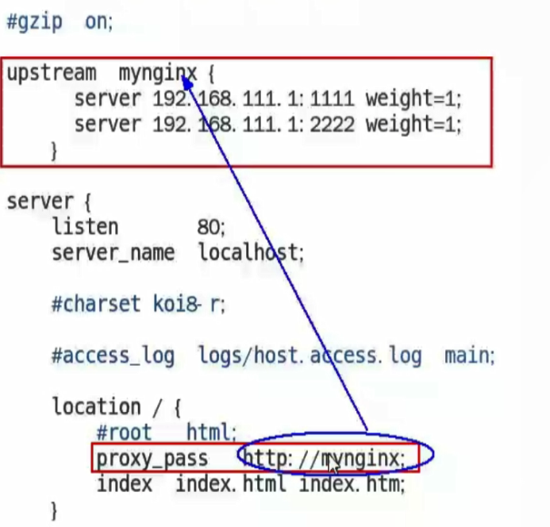

~~~cmd
./nginx -s stop 关闭
./nginx -s reload 重启
~~~

~~~

~~~

解决
  上redis分布式锁setnx

  官网
    https://redis.io/commands/set
  修改为3.0版

~~~java
String value = UUID.randomUUID().toString()+Thread.currentThread().getName();
//setIfAbsent() 就是如果不存在就新建
Boolean lockFlag = stringRedisTemplate.opsForValue().setIfAbsent(REDIS_LOCK_KEY, value);//setnx

if (!lockFlag) {  
    return "抢锁失败，┭┮﹏┭┮";
}

stringRedisTemplate.delete(REDIS_LOCK_KEY);//释放锁
~~~

##### 3.3 异常时无法释放锁

~~~java
}finally {
            stringRedisTemplate.delete(REDIS_LOCK_KEY);//释放锁
}
~~~

##### 3.4 宕机

需要对lockKey有过期时间的设定

~~~java
Boolean lockFlag = stringRedisTemplate.opsForValue().setIfAbsent(REDIS_LOCK_KEY, value);//setnx
stringRedisTemplate.expire(REDIS_LOCK_KEY,10L, TimeUnit.SECONDS);
~~~

##### 3.5 设置key与过期时间不是原子性

~~~java
 //setIfAbsent() == setnx 就是如果不存在就新建，同时加上过期时间保证原子性
Boolean lockFlag = stringRedisTemplate.opsForValue().setIfAbsent(REDIS_LOCK_KEY, value,10L, TimeUnit.SECONDS);
~~~

##### 3.6 张冠李戴，删除了别人的锁

~~~java
if (value.equalsIgnoreCase(stringRedisTemplate.opsForValue().get(REDIS_LOCK_KEY))){
    stringRedisTemplate.delete(REDIS_LOCK_KEY);//释放锁
}
~~~

##### 3.7 finally块的判断+del删除操作不是原子性的

###### 用redis自身的事务

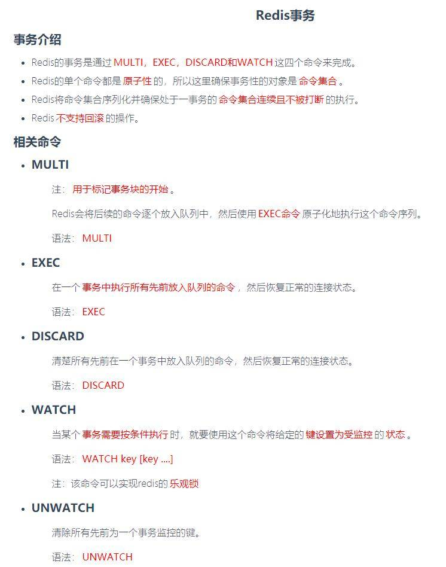

~~~java
}finally {
            while (true)
            {
                stringRedisTemplate.watch(REDIS_LOCK_KEY); //加事务，乐观锁
                if (value.equalsIgnoreCase(stringRedisTemplate.opsForValue().get(REDIS_LOCK_KEY))){
                    stringRedisTemplate.setEnableTransactionSupport(true);
                    stringRedisTemplate.multi();//开始事务
                    stringRedisTemplate.delete(REDIS_LOCK_KEY);
                    List<Object> list = stringRedisTemplate.exec();
                    if (list == null) {  //如果等于null，就是没有删掉，删除失败，再回去while循环那再重新执行删除
                        continue;
                    }
                }
                //如果删除成功，释放监控器，并且breank跳出当前循环
                stringRedisTemplate.unwatch();
                break;
            }
        }
~~~

###### 用Lua脚本

~~~java
public class RedisUtils {
    private static JedisPool jedisPool;
    static {
        JedisPoolConfig jedisPoolConfig = new JedisPoolConfig();
        jedisPoolConfig.setMaxTotal(20);
        jedisPoolConfig.setMaxIdle(10);
        jedisPool = new JedisPool(jedisPoolConfig,"ip",6379,100000);
    }
    public static Jedis getJedis() throws Exception{
        if (null!=jedisPool){
            return jedisPool.getResource();
        }
        throw new Exception("Jedispool is not ok");
    }
}
~~~

~~~java
}finally {
            Jedis jedis = RedisUtils.getJedis();

            String script = "if redis.call('get', KEYS[1]) == ARGV[1]"+"then "
                    +"return redis.call('del', KEYS[1])"+"else "+ "  return 0 " + "end";
                try{
                    Object result = jedis.eval(script, Collections.singletonList(REDIS_LOCK_KEY), Collections.singletonList(value));
                    if ("1".equals(result.toString())){
                        System.out.println("------del REDIS_LOCK_KEY success");
                    }else {
                        System.out.println("------del REDIS_LOCK_KEY error");
                    }
                    }finally {
                        if (null != jedis){
                            jedis.close();
                        }
                    }
	}
~~~

##### 3.8 确保redisLock过期时间大于业务执行时间的问题

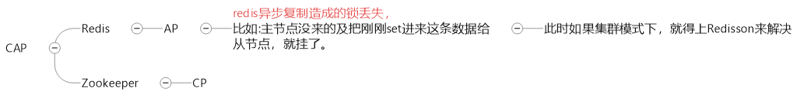

##### 3.9 redis集群环境下，我们自己写的也不OK, 直接上RedLock之Redisson落地实现

上Redisson

~~~java
/**
 * 保证不是序列化后的乱码配置
 */
@Configuration
    public class RedisConfig {

    @Value("${spring.redis.host}")
    private String redisHost;

        @Bean
        public RedisTemplate<String, Serializable> redisTemplate(LettuceConnectionFactory connectionFactory){
            RedisTemplate<String, Serializable> redisTemplate = new RedisTemplate<>();
            redisTemplate.setKeySerializer(new StringRedisSerializer());
            redisTemplate.setValueSerializer(new GenericJackson2JsonRedisSerializer());
            redisTemplate.setConnectionFactory(connectionFactory);
            return redisTemplate;
        }

    @Bean
    public Redisson redisson(){
        Config config = new Config();
        config.useSingleServer().setAddress("redis://"+redisHost+":6379").setDatabase(0);
        return (Redisson) Redisson.create(config);
    }
}
~~~

~~~java
String value = UUID.randomUUID().toString()+Thread.currentThread().getName();

        RLock redissonLock = redisson.getLock(REDIS_LOCK_KEY);
        redissonLock.lock();
        try{
                String result = stringRedisTemplate.opsForValue().get("goods:001");
                int goodsNumber = result == null ? 0 : Integer.parseInt(result);

                if (goodsNumber > 0){
                    int realNumber = goodsNumber - 1;
                    stringRedisTemplate.opsForValue().set("goods:001",realNumber + "");
                    System.out.println("你已经成功秒杀商品，此时还剩余：" + realNumber + "件"+"\t 服务器端口: "+serverPort);
                    return "你已经成功秒杀商品，此时还剩余：" + realNumber + "件"+"\t 服务器端口: "+serverPort;
                }else {
                    System.out.println("商品已经售罄/活动结束/调用超时，欢迎下次光临"+"\t 服务器端口: "+serverPort);
                }
                return "商品已经售罄/活动结束/调用超时，欢迎下次光临"+"\t 服务器端口: "+serverPort;

        }finally {
            redissonLock.unlock();
        }
~~~

###### 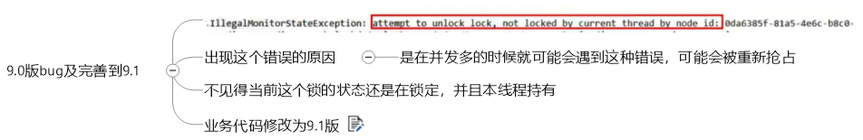

~~~java
//还在持有锁的状态，并且是当前线程持有的锁再解锁
if (redissonLock.isLocked() && redissonLock.isHeldByCurrentThread()){
    redissonLock.unlock();
}
~~~

~~~
总结
  synchronized      单机版oK，上分布式
    nginx分布式微服务 单机锁不行
      取消单机锁         上redis分布式锁setnx
        只加了锁，没有释放锁，  出异常的话，可能无法释放锁， 必须要在代码层面finally释放锁
          宕机了，部署了微服务代码层面根本没有走到finally这块， 没办法保证解锁，这个key没有被删除， 需要有lockKey的过期时间设定
            为redis的分布式锁key，增加过期时间 此外，还必须要setnx+过期时间必须同一行的原子性操作
              必须规定只能自己删除自己的锁， 你不能把别人的锁删除了, 防止张冠李戴，1删2,2删3
                lua或者事务
                  redis集群环境下，我们自己写的也不OK 直接上RedLock之Redisson落地实现
~~~

#### 4. redis缓存过期淘汰策略

~~~
粉丝反馈的面试题
  生产上你们的redis内存设置多少?
  如何配置、修改redis的内存大小
  如果内存满了你怎么办
  redis清理内存的方式?定期删除和惰性删除了解过吗
  redis缓存淘汰策略
  redis的LRu了解过吗?可否手写一个LRu算法
  。。。。。
~~~

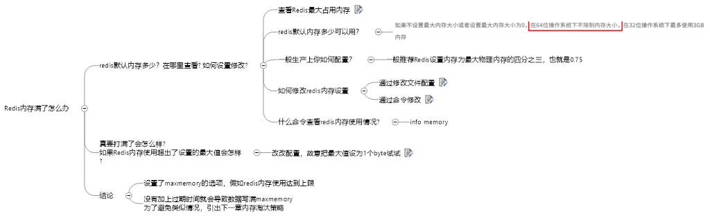

###### 查看Redis最大占用内存

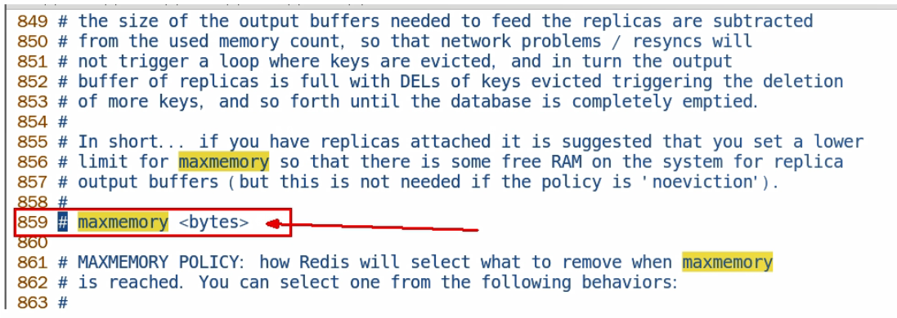

~~~
打开redis配置文件，设置maxmemory参数，maxmemory是bytes字节类型，注意转换。
没有配置最大内存或最大内存为0时，64位操作系统不限制上限，32位最多3GB
~~~

###### 真要打满了会怎么样? 

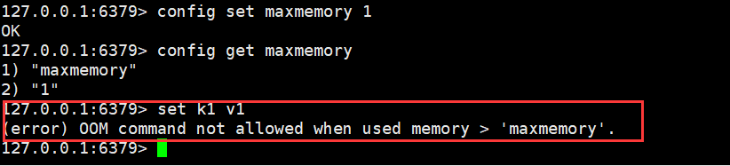

###### 通过修改文件配置

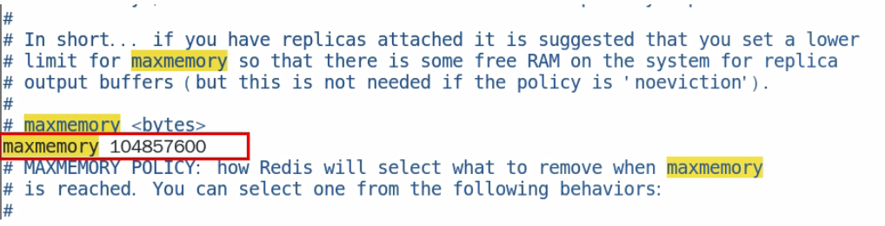

###### 通过命令修改

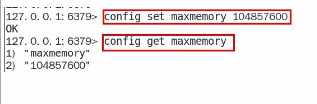

###### redis缓存淘汰策略

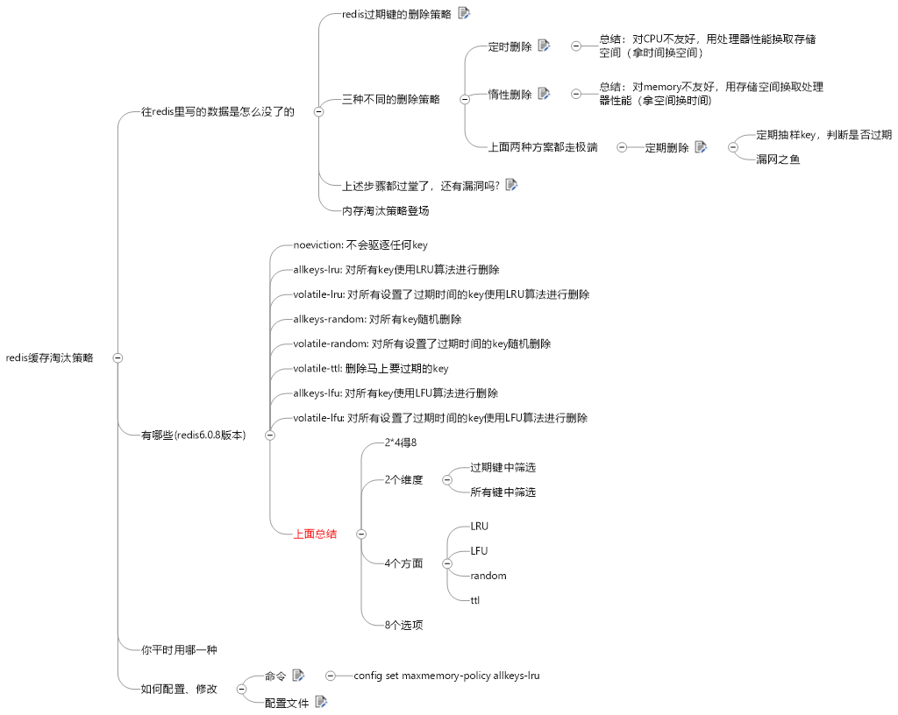

###### redis过期键的删除策略

~~~
如果一个键是过期的，那它到了过期时间之后是不是马上就从内存中被被删除呢??
 
如果回答yes，你自己走还是面试官送你?
 
如果不是，那过期后到底什么时候被删除呢?？是个什么操作?
~~~

###### 生产上使用

allkeys-lru: 对所有key使用LRU算法进行删除

#### 5. 手写LRU

##### 5.1 继承LinkedHashMap

~~~java
import java.util.LinkedHashMap;
import java.util.Map;

public class LRUCacheDemo<K,V> extends LinkedHashMap<K, V> {

    private int capacity;//缓存坑位

    public LRUCacheDemo(int capacity) {
        super(capacity,0.75F,false);
        this.capacity = capacity;
    }

    @Override
    protected boolean removeEldestEntry(Map.Entry<K, V> eldest) {
        return super.size() > capacity;
    }

    public static void main(String[] args) {
        LRUCacheDemo lruCacheDemo = new LRUCacheDemo(3);

        lruCacheDemo.put(1,"a");
        lruCacheDemo.put(2,"b");
        lruCacheDemo.put(3,"c");
        System.out.println(lruCacheDemo.keySet());

        lruCacheDemo.put(4,"d");
        System.out.println(lruCacheDemo.keySet());

        lruCacheDemo.put(3,"c");
        System.out.println(lruCacheDemo.keySet());
        lruCacheDemo.put(3,"c");
        System.out.println(lruCacheDemo.keySet());
        lruCacheDemo.put(3,"c");
        System.out.println(lruCacheDemo.keySet());
        lruCacheDemo.put(5,"x");
        System.out.println(lruCacheDemo.keySet());
    }
}
~~~

##### 5.2 手写LRU算法

~~~java

class LRU{
    public Map<Integer,Node> cache = new HashMap<>();
    public Node tail;
    public Node head;
    public int size;
    public int capacity;

    public LRU(int capacity) {
        this.capacity = capacity;
        this.size = 0;

        tail = new Node();
        head  = new Node();
        tail.pre = head;
        tail.post = null;
        head.post = tail;
        head.pre = null;

    }
    public int get(int key) {
        Node node = cache.get(key);
        if (node != null) {
            removeNode(node);
            addToHead(node);
            return node.value;
        }
        return -1;
    }
    public void put(int key,int value) {
        Node node = cache.get(key);
        if (node == null) {
            Node newNode = new Node();

            newNode.key = key;
            newNode.value = value;
            addToHead(newNode);

            cache.put(key,newNode);

            if (size > capacity) {
                // 移除最后一个
                removeLast();
            }
        } else {
            node.value = value;
            movoToHead(node);
        }
    }
    public void movoToHead(Node node) {
        removeNode(node);
        addToHead(node);
    }
    public void addToHead(Node node) {
        node.post = head.post;
        node.pre = head;
        head.post.pre = node;
        head.post = node;

        size ++;
    }
    // 移除最后一个
    public void removeLast() {
        // 移除当前节点
        cache.remove(tail.pre.key);
        removeNode(tail.pre);
    }
    // 移除当前节点
    public void removeNode(Node node) {
        node.pre.post = node.post;
        node.post.pre = node.pre;
        size --;
    }
}

class Node{
    public int key;
    public int value;
    public Node pre;
    public Node post;

    @Override
    public String toString() {
        return "Node{" +
                "key=" + key +
                ", value=" + value +
                '}';
    }
}

~~~

