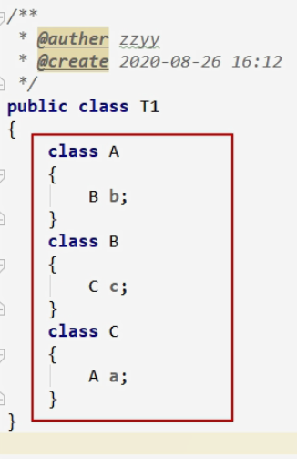
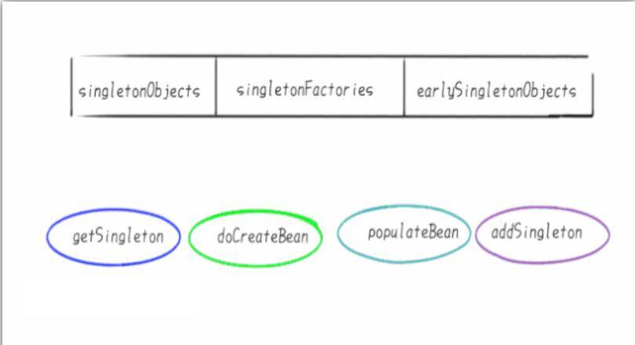
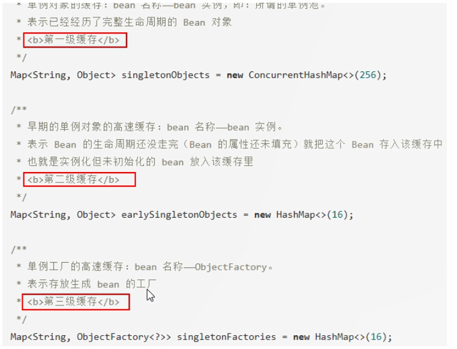
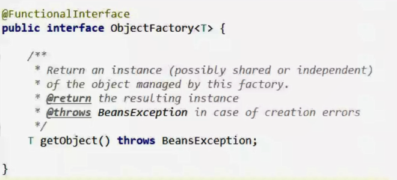
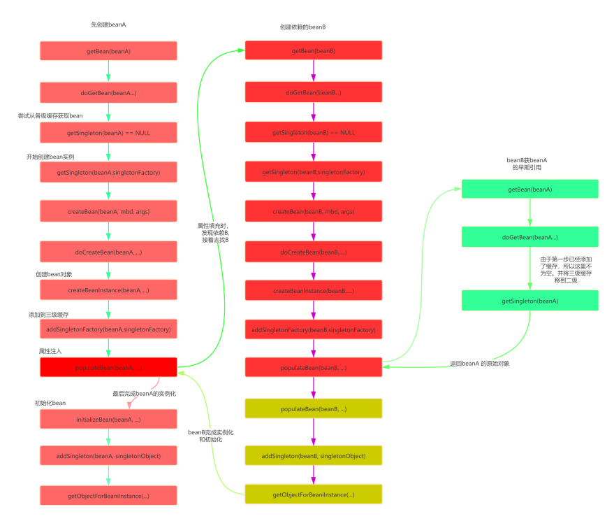

##  Spring循环依赖

### 1. 什么是循环依赖？

多个bean之间相互依赖，形成了一个闭环。 比如:A依赖于B、B依赖于c、c依赖于A

~~~java
public class A {
    private B b;
}

public class B {
    private A a;
}
/**********************/
<bean id="beanA" class="xyz.coolblog.BeanA">
    <property name="beanB" ref="beanB"/>
</bean>
<bean id="beanB" class="xyz.coolblog.BeanB">
    <property name="beanA" ref="beanA"/>
</bean>
~~~

IOC 按照上面所示的 <bean> 配置，实例化 A 的时候发现 A 依赖于 B 于是去实例化 B（此时 A 创建未结束，处于创建中的状态），而发现 B 又依赖于 A ，于是就这样循环下去，最终导致 OOM

### 2. 循环依赖的类型

Spring容器创建对象时，有：构造注入和set注入两种方式。

构造注入产生的循环依赖问题时是无解的，set方式产生的循环依赖问题可以通过`三级缓存`进行处理。

> 我们AB循环依赖问题只要A的注入方式是`setter`且`singleton`, 就不会有循环依赖问题

### 3. 三级缓存

> 所谓的三级缓存其实就是spring容器内部用来解决循环依赖问题的三个map

~~~markdown
第一级缓存〈也叫单例池）singletonObjects:存放已经经历了完整生命周期的Bean对象
第二级缓存: earlySingletonObjects，存放早期暴露出来的Bean对象，Bean的生命周期未结束（属性还未填充完整）
第三级缓存: Map<String, ObiectFactory<?>> singletonFactories，存放可以生成Bean的工厂
~~~

### 4. 循环依赖Debug

#### 4.1 实例化/初始化

~~~
实例化：申请空间

初始化：设置属性
~~~

#### 4.2 3大Map和四大方法，总体相关对象

~~~
三级缓存+四大方法：
	1.getSingleton：希望从容器里面获得单例的bean，没有的话
	2.doCreateBean: 没有就创建bean
	3.populateBean: 创建完了以后，要填充属性				4.addSingleton: 填充完了以后，再添加到容器进行使用
~~~

~~~
第一层singletonObjects存放的是已经初始化好了的Bean,
第二层earlySingletonObjects存放的是实例化了，但是未初始化的Bean,
第三层singletonFactories存放的是FactoryBean。假如A类实现了FactoryBean,那么依赖注入的时候不是A类，而是A类产生的Bean
~~~

#### 4.3 A/B两对象在三级缓存中的迁移说明

~~~
1 A创建过程中需要B，于是A将自己放到三级缓存里面，去实例化B
 
2 B实例化的时候发现需要A，于是B先查一级缓存，没有，再查二级缓存，还是没有，再查三级缓存，找到了A
然后把三级缓存里面的这个A放到二级缓存里面，并删除三级缓存里面的A
 
3 B顺利初始化完毕，将自己放到一级缓存里面（此时B里面的A依然是创建中状态）
然后回来接着创建A，此时B已经创建结束，直接从一级缓存里面拿到B，然后完成创建，并将A自己放到一级缓存里面。
~~~

### 5. 总结spring是如何解决的循环依赖?

~~~
Spring创建bean主要分为两个步骤，创建原始bean对象，接着去填充对象属性和初始化
每次创建bean之前，我们都会从缓存中查下有没有该bean，因为是单例，只能有一个
当我们创建 beanA的原始对象后，并把它放到三级缓存中，接下来就该填充对象属性了，这时候发现依赖了beanB，接着就又去创建beanB，同样的流程，创建完 beanB填充属性时又发现它依赖了beanA又是同样的流程，
不同的是：
这时候可以在三级缓存中查到刚放进去的原始对象beanA，所以不需要继续创建，用它注入beanB，完成beanB的创建
既然 beanB创建好了，所以beanA就可以完成填充属性的步骤了，接着执行剩下的逻辑，闭环完成
~~~

~~~
Spring解决循环依赖依靠的是Bean的“中间态"这个概念，而这个中间态指的是已经实例化但还没初始化的状态……>半成品。
实例化的过程又是通过构造器创建的，如果A还没创建好出来怎么可能提前曝光，所以构造器的循环依赖无法解决。
 
Spring为了解决单例的循环依赖问题，使用了三级缓存
其中一级缓存为单例池〈 singletonObjects)
二级缓存为提前曝光对象( earlySingletonObjects)
三级缓存为提前曝光对象工厂( singletonFactories）。
 
假设A、B循环引用，实例化A的时候就将其放入三级缓存中，接着填充属性的时候，发现依赖了B，同样的流程也是实例化后放入三级缓存，接着去填充属性时又发现自己依赖A，这时候从缓存中查找到早期暴露的A，没有AOP代理的话，直接将A的原始对象注入B，完成B的初始化后，进行属性填充和初始化，这时候B完成后，就去完成剩下的A的步骤，如果有AOP代理，就进行AOP处理获取代理后的对象A，注入B，走剩下的流程。

~~~

Debug步骤

~~~
1 调用doGetBean()方法，想要获取beanA，于是调用getSingleton()方法从缓存中查找beanA
2 在getSingleton()方法中，从一级缓存中查找，没有，返回null
3 doGetBean()方法中获取到的beanA为null，于是走对应的处理逻辑，调用getSingleton()的重载方法（参数为ObjectFactory的)
4 在getSingleton()方法中，先将beanA_name添加到一个集合中，用于标记该bean正在创建中。然后回调匿名内部类的creatBean方法
5 进入AbstractAutowireCapableBeanFactory#doCreateBean，先反射调用构造器创建出beanA的实例，然后判断。是否为单例、是否允许提前暴露引用(对于单例一般为true)、是否正在创建中〈即是否在第四步的集合中)。判断为true则将beanA添加到【三级缓存】中
6 对beanA进行属性填充，此时检测到beanA依赖于beanB，于是开始查找beanB
7 调用doGetBean()方法，和上面beanA的过程一样，到缓存中查找beanB，没有则创建，然后给beanB填充属性
8 此时beanB依赖于beanA，调用getsingleton()获取beanA，依次从一级、二级、三级缓存中找，此时从三级缓存中获取到beanA的创建工厂，通过创建工厂获取到singletonObject，此时这个singletonObject指向的就是上面在doCreateBean()方法中实例化的beanA
9 这样beanB就获取到了beanA的依赖，于是beanB顺利完成实例化，并将beanA从三级缓存移动到二级缓存中
10 随后beanA继续他的属性填充工作，此时也获取到了beanB，beanA也随之完成了创建，回到getsingleton()方法中继续向下执行，将beanA从二级缓存移动到一级缓存中
~~~

