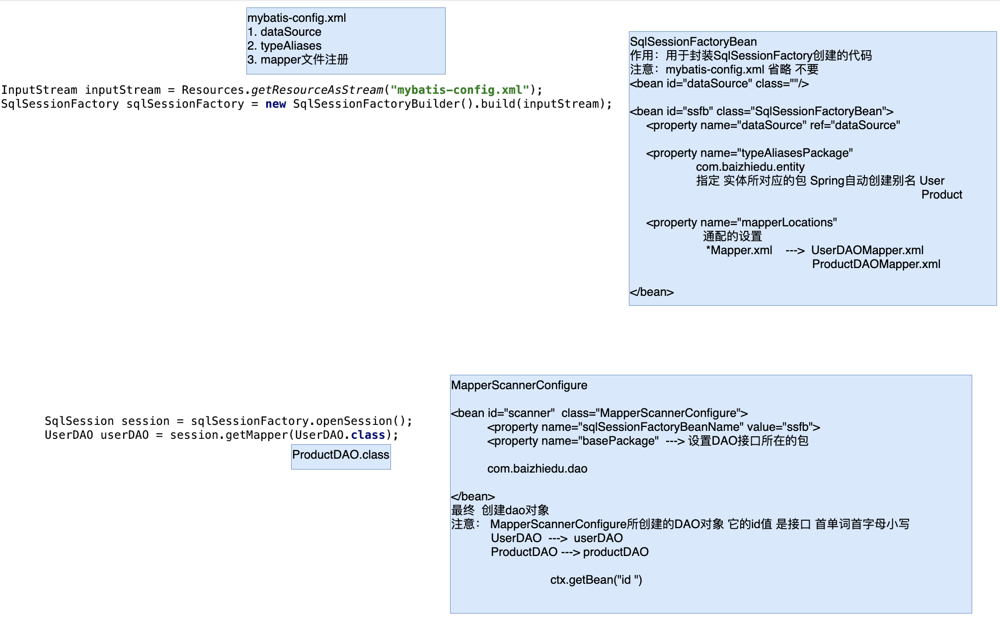

# Spring5

### Spring整合mybatis

##### 1. Spring与mybatis整合思路

~~~xml
<!--连接池-->
<bean id="dataSource" class="com.alibaba.druid.pool.DruidDataSource">
  <property name="driverClassName" value="com.mysql.jdbc.Driver"></property>
  <property name="url" value="jdbc:mysql://localhost:3306/suns?useSSL=false"></property>
  <property name="username" value="root"></property>
  <property name="password" value="123456"></property>
</bean>

<!--创建SqlSessionFactory SqlSessionFactoryBean-->
<bean id="sqlSessionFactoryBean" class="org.mybatis.spring.SqlSessionFactoryBean">
  <property name="dataSource" ref="dataSource"></property>
  <property name="typeAliasesPackage" value="com.baizhiedu.entity"></property>
  <property name="mapperLocations">
    <list>
      <value>classpath:com.baizhiedu.mapper/*Mapper.xml</value>
    </list>
  </property>
</bean>

<!--创建DAO对象 MapperScannerConfigure-->

<bean id="scanner" class="org.mybatis.spring.mapper.MapperScannerConfigurer">
  <property name="sqlSessionFactoryBeanName" value="sqlSessionFactoryBean"></property>
  <property name="basePackage" value="com.baizhiedu.dao"></property>
</bean>
~~~

##### 2. 事务注解配置

~~~xml
1.配置原始对象
<bean id="userService" class="com.baizhiedu.service.UserServiceImpl">
  <property name="userDAO" ref="userDAO"/>
</bean>
2.配置增强功能
<!--DataSourceTransactionManager-->
<bean id="dataSourceTransactionManager" class="org.springframework.jdbc.datasource.DataSourceTransactionManager">
  <property name="dataSource" ref="dataSource"/>
</bean>
3.配置切入点
@Transactional
public class UserServiceImpl implements UserService {
    private UserDAO userDAO;
4.组装切面
<tx:annotation-driven transaction-manager="dataSourceTransactionManager"/>
~~~

##### 3. 事务标签式配置

~~~xml
<bean id="userService" class="com.baizhiedu.service.UserServiceImpl">
  <property name="userDAO" ref="userDAO"/>
</bean>

<!--DataSourceTransactionManager-->
<bean id="dataSourceTransactionManager" class="org.springframework.jdbc.datasource.DataSourceTransactionManager">
  <property name="dataSource" ref="dataSource"/>
</bean>

编程时候 service中负责进行增删改操作的方法 都以modify开头
                       查询操作 命名无所谓 
<tx:advice id="txAdvice" transacation-manager="dataSourceTransactionManager">
    <tx:attributes>
          <tx:method name="register"></tx:method>
          <tx:method name="modify*"></tx:method>
          <tx:method name="*" propagation="SUPPORTS"  read-only="true"></tx:method>
    </tx:attributes>
</tx:advice>

应用的过程中，service放置到service包中
<aop:config>
     <aop:pointcut id="pc" expression="execution(* com.baizhiedu.service..*.*(..))"></aop:pointcut>
     <aop:advisor advice-ref="txAdvice" pointcut-ref="pc"></aop:advisor>
</aop:config>
~~~

##### 4. 事务属性

~~~
事务属性：描述事务特征的一系列值 
1. 隔离属性
2. 传播属性
3. 只读属性
4. 超时属性
5. 异常属性 
~~~

| 传播属性的值  | 外部不存在事务 | 外部存在事务               | 用法                                                    | 备注           |
| :-----------: | -------------- | -------------------------- | ------------------------------------------------------- | -------------- |
|   REQUIRED    | 开启新的事务   | 融合到外部事务中           | @Transactional(propagation = Propagation.REQUIRED)      | 增删改方法     |
|   SUPPORTS    | 不开启事务     | 融合到外部事务中           | @Transactional(propagation = Propagation.SUPPORTS)      | 查询方法       |
| REQUIRES_NEW  | 开启新的事务   | 挂起外部事务，创建新的事务 | @Transactional(propagation = Propagation.REQUIRES_NEW)  | 日志记录方法中 |
| NOT_SUPPORTED | 不开启事务     | 挂起外部事务               | @Transactional(propagation = Propagation.NOT_SUPPORTED) | 极其不常用     |
|     NEVER     | 不开启事务     | 抛出异常                   | @Transactional(propagation = Propagation.NEVER)         | 极其不常用     |
|   MANDATORY   | 抛出异常       | 融合到外部事务中           | @Transactional(propagation = Propagation.MANDATORY)     | 极其不常用     |