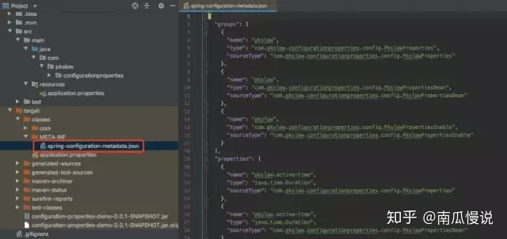
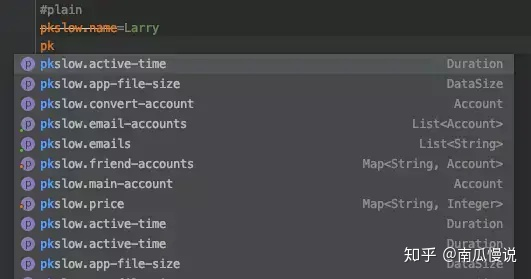

# @ConfigurationProperties

## 1 启动注解的三种方式

启动`@ConfigurationProperties`有三种方式，分别是：

### （1）属性类`@ConfigurationProperties`+属性类`@Component`

```java
@Component
@ConfigurationProperties(prefix = "pkslow")
public class PkslowProperties {
    private String name;
    private List<String> emails;
    private Map<String, Integer> price;
  //getter and setter
}
```

在属性配置类上加注解`@ConfigurationProperties`是三种方式都需要的，第一种方式通过`@Component`声明为一个可用的Bean。实际不一定是`@Component`，`@Service`等也是可以的。

### （2）属性类`@ConfigurationProperties`+配置类`@Bean`

在配置类中通过`@Bean`声明：

```java
@Configuration
public class Config {
    @Bean
    public PkslowProperties pkslowProperties(){
        return new PkslowProperties();
    }
}
```

### （3）属性类`@ConfigurationProperties`+配置类`@EnableConfigurationProperties`

我们可以在Springboot启动类中加上注解`@EnableConfigurationProperties`来声明：

```java
@SpringBootApplication
@EnableConfigurationProperties(PkslowProperties.class)
public class ConfigurationPropertiesDemoApplication {
    public static void main(String[] args) {
        SpringApplication.run(ConfigurationPropertiesDemoApplication.class, args);
    }
}
```

## 2 两大优点

### 2.1 宽松的绑定规则

支持宽松的绑定规则，以下格式都可以识别为`accountType`属性：

```properties
pkslow.accountType=QQ
pkslow.accounttype=QQ
pkslow.account_type=QQ
pkslow.account-type=QQ
pkslow.ACCOUNT_TYPE=QQ
```

### 2.2 支持多种属性类型

支持多种属性类型，Java类如下：

```java
@Component
@ConfigurationProperties(prefix = "pkslow")
@Data
public class PkslowProperties {
    private String name;
    private List<String> emails;
    private Map<String, Integer> price;
    private Account mainAccount;
    private List<Account> emailAccounts;
    private Map<String, Account> friendAccounts;
    private Duration activeTime;
    private DataSize appFileSize;
}
```

配置如下：

```properties
#普通类型
pkslow.name=Larry
#List
pkslow.emails[0]=larry@qq.com
pkslow.emails[1]=larry@gmail.com
#Map
pkslow.price.shoe=200
pkslow.price.pen=10
pkslow.price.book=43
#Object
pkslow.mainAccount.username=larry
pkslow.mainAccount.password=123456
pkslow.mainAccount.accountType=Main
#List<Object>
pkslow.emailAccounts[0].username=larry
pkslow.emailAccounts[0].password=******
pkslow.emailAccounts[0].accounttype=QQ
pkslow.emailAccounts[1].username=larry
pkslow.emailAccounts[1].password=xxxxxx
pkslow.emailAccounts[1].account_type=Gmail
pkslow.emailAccounts[2].username=larry
pkslow.emailAccounts[2].password=xxxxxx
pkslow.emailAccounts[2].account-type=163
pkslow.emailAccounts[3].username=larry
pkslow.emailAccounts[3].password=xxxxxx
pkslow.emailAccounts[3].ACCOUNT_TYPE=Apple
#Map<String, Object>
pkslow.friendAccounts.JJ.username=JJ
pkslow.friendAccounts.JJ.password=******
pkslow.friendAccounts.JJ.accountType=QQ
pkslow.friendAccounts.Larry.username=Larry
pkslow.friendAccounts.Larry.password=******
pkslow.friendAccounts.Larry.accountType=QQ
#Duration
pkslow.activeTime=30d
#DataSize
pkslow.appFileSize=10KB
```

`Duration`为持续时间属性，可支持的单位有：

- ns：nanosecond，纳秒
- us：microsecond，微秒
- ms：millisecond，毫秒
- s：second，秒
- m ：minute，分
- h：hour，小时
- d ：day，天

不写默认为毫秒，也可以通过注解`@DurationUnit`来指定单位。

```java
@DurationUnit(ChronoUnit.DAYS)
private Duration timeInDays;
```

`DataSize`类似，用来表示文件大小，支持的单位有：B/KB/MB/GB/TB。默认单位为`B`，可以用`@DataSizeUnit`指定单位。

## 3 属性转换失败处理

### 4.1 无法转换的类型

有时配置错误，就会无法转换成正常的类型，例如属性为布尔类型，却定义为`pkslow.enabled=open`，那肯定是无法转换的。默认会启动失败，并抛出异常。

```java
Description:
Failed to bind properties under 'pkslow.enabled' to boolean:
    Property: pkslow.enabled
    Value: open
    Origin: class path resource [application.properties]:46:16
    Reason: failed to convert java.lang.String to boolean

Action:
Update your application's configuration
```

但如果我们并不想影响Springboot的启动，可以通过设置 `ignoreInvalidFields` 属性为 true （默认为 false），就会忽略错误的属性。

```java
@Component
@ConfigurationProperties(prefix = "pkslow", ignoreInvalidFields = true)
public class PkslowProperties {
}
```

设置之后，错误的属性就会取默认值，如`null`或`false`。

### 3.2 未知的属性

如果写错的不是配置的值，而是配置的项，会发生什么呢？

```properties
#Java类没有该属性myAppName
pkslow.myAppName=pkslow
```

结果是什么也不会发生。

因为在默认情况下，Springboot 会忽略那些不能识别的字段。如果你希望它在这种情况下启动失败，可以配置`ignoreUnknownFields`为`false`，默认是为`true`的。这样你就必须要删除这个配置错误的属性了。

```java
@Component
@ConfigurationProperties(prefix = "pkslow", ignoreUnknownFields = false)
public class PkslowProperties {
}
```

有两点需要注意：

（1）如果设置`ignoreInvalidFields`为`true`，则`ignoreUnknownFields`不起作用；

（2）带有 `@ConfigurationProperties` 的不同的类不要使用相同的前缀（命名空间），容易造成冲突，如某个属性一个可用，一个不可用。

## 4 自定义转换器

如前面讲解的`Duration`和`DataSize`，都是比较特殊的属性。实际上我们还可以自定义属性，并自定义转换器来实现属性绑定。

配置如下：

```properties
pkslow.convertAccount=Larry:123456:QQ
```

对应的属性为：

```properties
private Account convertAccount;
```

其中`Account`类如下：

```java
@Data
@NoArgsConstructor
@AllArgsConstructor
public class Account {
    private String username;
    private String password;
    private String accountType;
}
```

通过实现`Converter`接口自定义转换器如下：

```java
public class AccountConverter implements Converter<String, Account> {
    @Override
    public Account convert(String s) {
        String[] strings = s.split(":");
        return new Account(strings[0], strings[1], strings[2]);
    }
}
```

通过注解`@ConfigurationPropertiesBinding`声明启用该转换器：

```java
@Configuration
public class Config {
    @Bean
    @ConfigurationPropertiesBinding
    public AccountConverter accountConverter() {
        return new AccountConverter();
    }
}
```

完成以上，就可以使用自定义的属性和配置了。

## 5 使用Spring Boot Configuration Processor

自定义的属性在IDE中是有告警的，无法被识别成合法的配置。通过引入Springboot Configuration Processor可以解决这个问题，并且IDE还能启动自动补全功能。

引入：

```xml
<dependency>
  <groupId>org.springframework.boot</groupId>
  <artifactId>spring-boot-configuration-processor</artifactId>
  <optional>true</optional>
</dependency>
```

## 5.1 完成自动补全

引入依赖后，重新build一下project就可以了。它会为我们创建一个Json格式的文件：



## 5.2 标记配置属性为 Deprecated

把注解`@DeprecatedConfigurationProperty`放在getter方法，该属性还会被显示为Deprecated：

```java
@Component
@ConfigurationProperties(prefix = "pkslow")
public class PkslowProperties {
    private String name;
    @DeprecatedConfigurationProperty
    public String getName() {
        return name;
    }
}
```

自动补全和Deprecated的效果如下：



---

#### 参考文章：https://zhuanlan.zhihu.com/p/102308012

