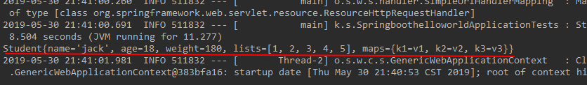
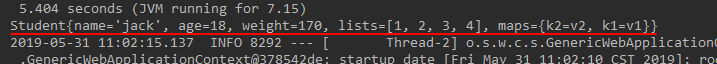
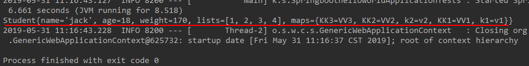

## 资源型注解

#### 1.@ConfigurationProperties

标注了这个注解的类，告诉springboot,所有的相关属性，都与配置文件里设置的属性进行绑定。用@ConfigurationProperties中可以设置prefix = "xxxx"前缀来标识。

~~~yml
student:
  name: jack
  age: 18
  weight: 180
  lists: [1,2,3,4,5]
  maps: {k1: v1,k2: v2,k3: v3}
~~~

//部分代码，省去了get set与toostring方法


```java
@Component
@ConfigurationProperties(prefix = "student")
public class Student {
    private  String name;
    private Integer age;
    private Integer weight;
    private List<String> lists;
    private Map<String,String>maps;
}
```


进行测试：


```java
@RunWith(SpringRunner.class)
@SpringBootTest
public class SpringboothelloworldApplicationTests {
    @Autowired
    private Student student;
    @Test
    public void contextLoads() {
        System.out.println(student);
    }
}
```

控制台输出结果



可以看到属性已经成功绑定。

#### 2.@PropertySource

加载指定的配置文件，SpringBoot默认加载的是application.properties那么也就是说我们所有的配置信息都要放在这个文件里面，如果我们想指定加载配置文件，就可以通过@PropertySource代码如下：
配置了一个student.properties

~~~properties
student.name=jack
student.age=18
student.weight=170
student.lists=1,2,3,4
student.maps.k1=v1
student.maps.k2 =v2
~~~


指定加载student.properties,通过配置@PropertySource(value = {"classpath:student.properties"})


```java
@Component
@PropertySource(value = {"classpath:student.properties"})
@ConfigurationProperties(prefix = "student")
public class Student {
	private  String name;
    private Integer age;
    private Integer weight;
    private List<String> lists;
    private Map<String,String>maps;
}
```


同样进行测试打印输出结果如下：



可以看到student.properties配置的内容被成功加载。

#### 3.@ImportResource

因为SpringBoot是没有配置文件的，如果我想让我们编写的Spring配置文件生效，如beans.xml，就可以使用@ImportResource注解，将配置文件导入进来。
首先先编写一个beans.xml，设置Student基本的属性


```xml
<?xml version="1.0" encoding="UTF-8"?>
<beans xmlns="http://www.springframework.org/schema/beans"
       xmlns:xsi="http://www.w3.org/2001/XMLSchema-instance"
       xsi:schemaLocation="http://www.springframework.org/schema/beans http://www.springframework.org/schema/beans/spring-beans.xsd">
    <bean id="StudentByxml" class="com.kuake.springbootHelloworld.entity.Student">
        <property name="name" value="jack"></property>
        <property name="age" value="18"></property>
        <property name="weight" value="175"></property>
        <property name="lists">
            <list>
                <value>1</value>
                <value>11</value>
                <value>1111</value>
            </list>
        </property>

        <property name="maps">
            <props>
                <prop key="KK1">VV1</prop>
                <prop key="KK2">VV2</prop>
                <prop key="KK3">VV3</prop>
            </props>
        </property>
    </bean>
</beans>
```

编写测试方法：

```java
@Resource(name = "StudentByxml")
private  Student studentByxml;

@Test
public void contextLoads() {
	System.out.println(studentByxml);
}
```


看一下控制台输出结果：



可以看到学生的信息，就是我们在beans.xml当中配置的信息，说明配置文件被成功加载。**这里用的是@Resource**

总结：
@ConfigurationProperties用来告知，标注该注解的类与配置文件进行绑定，通过设置的前缀，来进行属性设置。
@PropertySource用来加载另外的xxxx.properties文件
@ImportResource 用来加载spring.xml的配置文件

————————————————
版权声明：本文为CSDN博主「莫失莫忘hh」的原创文章，遵循CC 4.0 BY-SA版权协议，转载请附上原文出处链接及本声明。
原文链接：https://blog.csdn.net/weixin_43732955/article/details/90706827