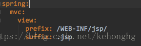
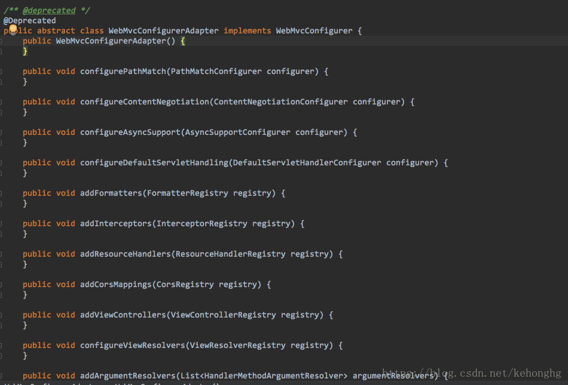

## WebMvcConfigurer

WebMvcConfigurer配置类其实是`Spring`内部的一种配置方式，采用`JavaBean`的形式来代替传统的`xml`配置文件形式进行针对框架个性化定制，可以自定义一些Handler，Interceptor，ViewResolver，MessageConverter。基于java-based方式的spring mvc配置，需要创建一个**配置**类并实现**`WebMvcConfigurer`** 接口；

在Spring Boot 1.5版本都是靠重写**WebMvcConfigurerAdapter**的方法来添加自定义拦截器，消息转换器等。SpringBoot 2.0 后，该类被标记为@Deprecated（弃用）。官方推荐直接实现WebMvcConfigurer或者直接继承WebMvcConfigurationSupport，方式一实现WebMvcConfigurer接口（推荐），方式二继承WebMvcConfigurationSupport类，具体实现可看这篇文章。https://blog.csdn.net/fmwind/article/details/82832758

springboot2.0之后配置拦截器extends 的WebMvcConfigurerAdapter过时，取而代之的是WebMvcConfigurationSupport

查看源码发现: WebMvcConfigurerAdapter只是对WebMvcCofigurer的空实现,而WebMvcConfigurationSupport的实现的方法更全面

但是继承WebMvcConfigurationSupport会发现Spring Boot的WebMvc自动配置失效(WebMvcAutoConfiguration自动化配置)，导致无法视图解析器无法解析并返回到对应的视图

WebMvcConfigurationSupport-->不需要返回逻辑视图,可以选择继承此类

WebMvcCofigurer-->返回逻辑视图,可以选择实现此方法,重写addInterceptor方法

关于WebMvcAutoConfiguration的源码分析参考：https://blog.csdn.net/qq_26000415/article/details/78998669
————————————————
版权声明：本文为CSDN博主「码农小站」的原创文章，遵循CC 4.0 BY-SA版权协议，转载请附上原文出处链接及本声明。
原文链接：https://blog.csdn.net/kehonghg/article/details/81180731