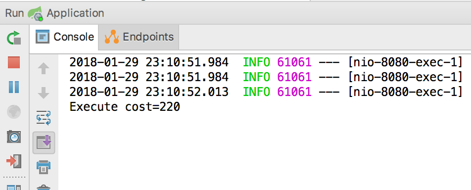
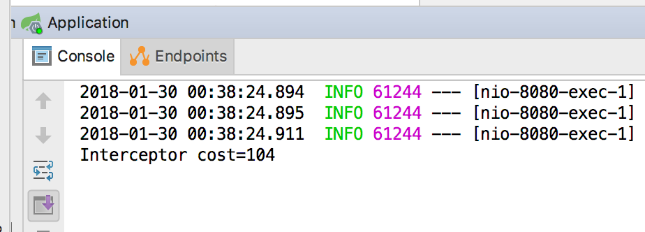

## Spring Boot实战：拦截器与过滤器

~~~text
1.过滤器的批量拦截路径为：/* ，/或者/**不能进行拦截
2.过滤器实现Filter接口以后，加入 @Component即可以加入IOC容器中
3.也可以使用@WebFilter(urlPatterns = "/*", filterName = "logFilter2") 和 @ServletComponentScan("com.pandy.blog.filters") 进行过滤器的配置
4.也可使用FilterRegistrationBean 对过滤器进行配置
5.如在过滤器中需要使用其他bean，可以使用对过滤器使用@Component注解，spring会进行注入，或者也可使用FilterRegistrationBean配置过滤器时候，先使用@Bean标签将自定义过滤器注入到spring容器再进行操作

6.拦截器同理
7. new 出来的对象不会交给spring容器进行管理，同样我们再new出的对象中，也无法使用@Autowired进行注入。需要先通过@Component或者@Bean将自定义对象交给spring容器进行操作
~~~


**一、拦截器与过滤器**

　　在讲Spring boot之前，我们先了解一下过滤器和拦截器。这两者在功能方面很类似，但是在具体技术实现方面，差距还是比较大的。在分析两者的区别之前，我们先理解一下AOP的概念，AOP不是一种具体的技术，而是一种编程思想。在面向对象编程的过程中，我们很容易通过继承、多态来解决纵向扩展。 但是对于横向的功能，比如，在所有的service方法中开启事务，或者统一记录日志等功能，面向对象的是无法解决的。所以AOP——面向切面编程其实是面向对象编程思想的一个补充。而我们今天讲的过滤器和拦截器都属于面向切面编程的具体实现。而两者的主要区别包括以下几个方面：

　　1、Filter是依赖于Servlet容器，属于Servlet规范的一部分，而拦截器则是独立存在的，可以在任何情况下使用。

　　2、Filter的执行由Servlet容器回调完成，而拦截器通常通过动态代理的方式来执行。

　　3、Filter的生命周期由Servlet容器管理，而拦截器则可以通过IoC容器来管理，因此可以通过注入等方式来获取其他Bean的实例，因此使用会更方便。

 

**二、过滤器的配置**

　　现在我们通过过滤器来实现记录请求执行时间的功能，其实现如下：

```java
public class LogCostFilter implements Filter {
    @Override
    public void init(FilterConfig filterConfig) throws ServletException {
    }

    @Override
    public void doFilter(ServletRequest servletRequest, ServletResponse servletResponse, FilterChain filterChain) throws IOException, ServletException, IOException {
        long start = System.currentTimeMillis();
        filterChain.doFilter(servletRequest, servletResponse);
        System.out.println("Execute cost=" + (System.currentTimeMillis() - start));
    }

    @Override
    public void destroy() {
    }
}
```

　　这段代码的逻辑比较简单，就是在方法执行前先记录时间戳，然后通过过滤器链完成请求的执行，在返回结果之间计算执行的时间。这里需要主要，这个类必须继承Filter类，这个是Servlet的规范，这个跟以前的Web项目没区别。但是，有了过滤器类以后，以前的web项目可以在web.xml中进行配置，但是spring boot项目并没有web.xml这个文件，那怎么配置？在Spring boot中，我们需要FilterRegistrationBean来完成配置。其实现过程如下：

```java
@Configuration
public class FilterConfig {
    @Bean
    public FilterRegistrationBean registFilter() {
        FilterRegistrationBean registration = new FilterRegistrationBean();
        registration.setFilter(new LogCostFilter());
        registration.addUrlPatterns("/*");
        registration.setName("LogCostFilter");
        registration.setOrder(1);
        return registration;
    }
}
```

　　这样配置就完成了，需要配置的选项主要包括实例化Filter类，然后指定url的匹配模式，设置过滤器名称和执行顺序，这个过程和在web.xml中配置其实没什么区别，只是形式不同而已。现在我们可以启动服务器访问任意URL：



　　大家可以看到上面的配置已经生效了。除了通过 FilterRegistrationBean 来配置以外，还有一种更直接的办法，直接通过注解就可以完成了：

```java
@WebFilter(urlPatterns = "/*", filterName = "logFilter2")
public class LogCostFilter2 implements Filter {
    @Override
    public void init(FilterConfig filterConfig) throws ServletException {
    }

    @Override
    public void doFilter(ServletRequest servletRequest, ServletResponse servletResponse, FilterChain filterChain) throws IOException, ServletException {
        long start = System.currentTimeMillis();
        filterChain.doFilter(servletRequest, servletResponse);
        System.out.println("LogFilter2 Execute cost=" + (System.currentTimeMillis() - start));
    }

    @Override
    public void destroy() {
    }
}
```

　　这里直接用@WebFilter就可以进行配置，同样，可以设置url匹配模式，过滤器名称等。这里需要注意一点的是@WebFilter这个注解是Servlet3.0的规范，并不是Spring boot提供的。除了这个注解以外，我们还需在配置类中加另外一个注解：@ServletComponetScan，指定扫描的包。

```
@SpringBootApplication
@MapperScan("com.pandy.blog.dao")
@ServletComponentScan("com.pandy.blog.filters")
public class Application {
    public static void main(String[] args) throws Exception {
        SpringApplication.run(Application.class, args);
    }
}
```

　　现在，我们再来访问一下任意URL：


　　可以看到，我们配置的两个过滤器都生效了。细心的读者会发现，第二个Filter我们并没有指定执行的顺序，但是却在第一个Filter之前执行。这里需要解释一下，@WebFilter这个注解并没有指定执行顺序的属性，其执行顺序依赖于Filter的名称，是根据Filter类名（注意不是配置的filter的名字）的字母顺序倒序排列，并且@WebFilter指定的过滤器优先级都高于FilterRegistrationBean配置的过滤器。有兴趣的朋友可以自己实验一下。

 

**三、拦截器的配置**

 　上面我们已经介绍了过滤器的配置方法，接下来我们再来看看如何配置一个拦截器。我们使用拦截器来实现上面同样的功能，记录请求的执行时间。首先我们实现拦截器类：

```java
public class LogCostInterceptor implements HandlerInterceptor {
    long start = System.currentTimeMillis();

    @Override
    public boolean preHandle(HttpServletRequest httpServletRequest, HttpServletResponse httpServletResponse, Object o) throws Exception {
        start = System.currentTimeMillis();
        return true;
    }

    @Override
    public void postHandle(HttpServletRequest httpServletRequest, HttpServletResponse httpServletResponse, Object o, ModelAndView modelAndView) throws Exception {
        System.out.println("Interceptor cost=" + (System.currentTimeMillis() - start));
    }

    @Override
    public void afterCompletion(HttpServletRequest httpServletRequest, HttpServletResponse httpServletResponse, Object o, Exception e) throws Exception {
    }
}
```

　　这里我们需要实现HandlerInterceptor这个接口，这个接口包括三个方法，preHandle是请求执行前执行的，postHandler是请求结束执行的，但只有preHandle方法返回true的时候才会执行，afterCompletion是视图渲染完成后才执行，同样需要preHandle返回true，该方法通常用于清理资源等工作。除了实现上面的接口外，我们还需对其进行配置：

```java
@Configuration
public class InterceptorConfig extends WebMvcConfigurerAdapter {
    @Override
    public void addInterceptors(InterceptorRegistry registry) {
        registry.addInterceptor(new LogCostInterceptor()).addPathPatterns("/**");
        super.addInterceptors(registry);
    }
}
```

　　这里我们继承了WebMVCConfigurerAdapter，看过前面的文章的朋友应该已经见过这个类了，在进行静态资源目录配置的时候我们用到过这个类。这里我们重写了addInterceptors这个方法，进行拦截器的配置，主要配置项就两个，一个是指定拦截器，第二个是指定拦截的URL。现在我们再启动系统访问任意一个URL：



 　可以看到，我们通过拦截器实现了同样的功能。不过这里还要说明一点的是，其实这个实现是有问题的，因为preHandle和postHandle是两个方法，所以我们这里不得不设置一个共享变量start来存储开始值，但是这样就会存在线程安全问题。当然，我们可以通过其他方法来解决，比如通过ThreadLocal就可以很好的解决这个问题，有兴趣的同学可以自己实现。不过通过这一点我们其实可以看到，虽然拦截器在很多场景下优于过滤器，但是在这种场景下，过滤器比拦截器实现起来更简单。

 

**四、总结**

　　本文主要对基于Spring boot对过滤器和拦截器的配置进行的讲解。无论是过滤器还是拦截器都属于AOP（面向切面编程）思想的具体实现。除了这两种实现我们还见过另一种更灵活的AOP实现技术，即Aspect，我们可以通过Aspect来完成更多更强大的功能。这个后续再给大家分享。

 作者：[liuxiaopeng](http://www.cnblogs.com/paddix)

 博客地址：[http://www.cnblogs.com/paddix/](http://www.cnblogs.com/paddix)

 声明：转载请在文章页面明显位置给出原文连接。 