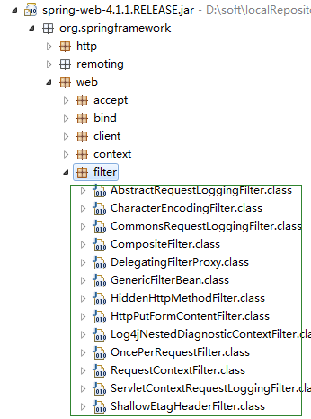

## [过滤器，拦截器，监听器的区别](https://www.cnblogs.com/raising/p/14364864.html)

 原文转自： https://cnblogs.com/lukelook/p/11079113.html


#### 1. 过滤器和拦截器的区别：

~~~
	①拦截器是基于java的反射机制的，而过滤器是基于函数回调。
	②拦截器不依赖与servlet容器，过滤器依赖与servlet容器。
	③拦截器只能对action请求起作用，而过滤器则可以对几乎所有的请求起作用。
	④拦截器可以访问action上下文、值栈里的对象，而过滤器不能访问。
	⑤在action的生命周期中，拦截器可以多次被调用，而过滤器只能在容器初始化时被调用一次。
	⑥拦截器可以获取IOC容器中的各个bean，而过滤器就不行，这点很重要，在拦截器里注入一个service，可以调用业务逻辑。
~~~

#### 2. 触发时机

1. 过滤器和拦截器触发时机不一样:

~~~
过滤器是在请求进入容器后，但请求进入servlet之前进行预处理的。请求结束返回也是，是在servlet处理完后，返回给前端之前。

总结：过滤器包裹住servlet，servlet包裹住拦截器。
~~~

如下图所示：


2. 过滤器的触发时机是容器后，servlet之前

所以过滤器的`doFilter(ServletRequest request, ServletResponse response, FilterChain chain)`的入参是ServletRequest ，而不是httpservletrequest。因为过滤器是在httpservlet之前。

```
@Override
    public void doFilter(ServletRequest request, ServletResponse response, FilterChain chain) throws IOException, ServletException {
        System.out.println("before...");
        chain.doFilter(request, response);
        System.out.println("after...");
    }
```

```
chain.doFilter(request, response);这个方法的调用作为分水岭。
事实上调用Servlet的doService()方法是在chain.doFilter(request, response)这个方法中进行的。
```

3. 过滤器是JavaEE标准，采用函数回调的方式进行。是在请求进入容器之后，还未进入Servlet之前进行预处理，并且在请求结束返回给前端这之间进行后期处理。拦截器是被包裹在过滤器之中的。

```
  @Override
    public boolean preHandle(HttpServletRequest request, HttpServletResponse response, Object handler) throws Exception {
        System.out.println("preHandle");
        return true;
    }

    @Override
    public void postHandle(HttpServletRequest request, HttpServletResponse response, Object handler, ModelAndView modelAndView) throws Exception {
        System.out.println("postHandle");
    }

    @Override
    public void afterCompletion(HttpServletRequest request, HttpServletResponse response, Object handler, Exception ex) throws Exception {
        System.out.println("afterCompletion");
    }
```

~~~
	a.preHandle()这个方法是在过滤器的chain.doFilter(request, response)方法的前一步执行，也就是在 [System.out.println("before...")] [chain.doFilter(request, response)]之间执行。该方法将在请求处理之前进行调用，如果已经是最后一个Interceptor 的时候就会是调用当前请求的Controller 方法。

　　b.postreHandle()方法之后，在return ModelAndView之前进行，可以操控Controller的ModelAndView内容。当前请求进行处理之后，也就是Controller 方法调用之后执行，但是它会在DispatcherServlet 进行视图返回渲染之前被调用，所以我们可以在这个方法中对Controller 处理之后的ModelAndView 对象进行操作。postHandle 方法被调用的方向跟preHandle 是相反的，也就是说先声明的Interceptor 的postHandle 方法反而会后执行。 

　　c.afterCompletion()方法是在过滤器返回给前端前一步执行，也就是在[chain.doFilter(request, response)][System.out.println("after...")]之间执行。该方法将在整个请求结束之后，也就是在DispatcherServlet 渲染了对应的视图之后执行。这个方法的主要作用是用于进行资源清理工作的。
~~~

4. SpringMVC的机制是由同一个Servlet来分发请求给不同的Controller，其实这一步是在Servlet的service()方法中执行的。所以过滤器、拦截器、service()方法，dispatc()方法的执行顺序应该是这样的，大致画了个图：其实非常好测试，自己写一个过滤器，一个拦截器，然后在这些方法中都加个断点，一路F8下去就得出了结论。

5. SpringMVC的机制是由同一个Servlet来分发请求给不同的Controller，其实这一步是在Servlet的service()方法中执行的。

6. 7. 还有，拦截器是spring容器的，是spring支持的，

**总结：**拦截器功在对请求权限鉴定方面确实很有用处，在我所参与的这个项目之中，第三方的远程调用每个请求都需要参与鉴定，所以这样做非常方便，而且他是很独立的逻辑，这样做让业务逻辑代码很干净。和框架的其他功能一样，原理很简单，使用起来也很简单，大致看了下SpringMVC这一部分的源码，其实还是比较容易理解的。

　　我们项目中仅仅用到了preHandle这个方法，而未用其他的，框架提供了一个已经实现了拦截器接口的适配器类HandlerInterceptorAdapter，继承这个类然后重写一下需要用到的方法就行了，可以少几行代码，这种方式Java中很多地方都有体现。


  

#### **一.过滤器** （**过滤器依赖与servlet容器**）

SpringMVC框架是一个成熟的优秀java web开发框架，学习研究框架设计有助于我们更好的理解和掌握spring MVC，设计和写出更符合的结构和代码。

本节主要是研读SpringMVC框架中的过滤器设置，以编码处理过滤器为例来学习框架内是怎样设置过滤器的。



如上所示的spring-web.jar包结构所示， Spring的web包中中提供有很多过滤器，这些过滤器位于org.springframework.web.filter并且理所当然地实现了javax.servlet.Filter，

**不过实现的方式有以下几类**：

​    (1) 直接实现Filter，这一类过滤器只有CompositeFilter；

​    (2) 继承抽象类GenericFilterBean，该类实现了javax.servlet.Filter，这一类的过滤器只有一个，即DelegatingFilterProxy；

​    (3) 继承抽象类OncePerRequestFilter，该类为GenericFilterBean的直接子类，这一类过滤器包括CharacterEncodingFilter、HiddenHttpMethodFilter、HttpPutFormContentFilter、RequestContextFilter和ShallowEtagHeaderFilter；

​    (4) 继承抽象类AbstractRequestLoggingFilter，该类为OncePerRequestFilter的直接子类，这一类过滤器包括CommonsRequestLoggingFilter、Log4jNestedDiagnosticContextFilter和ServletContextRequestLoggingFilter。

**过滤器放在容器结构的什么位置？**

过滤器放在web资源之前，可以在请求抵达它所应用的web资源(可以是一个Servlet、一个Jsp页面，甚至是一个HTML页面)之前截获进入的请求，并且在它返回到客户之前截获输出请求。Filter：用来拦截请求，处于客户端与被请求资源之间，目的是重用代码。Filter链，在web.xml中哪个先配置，哪个就先调用。在filter中也可以配置一些初始化参数。

Java中的Filter 并不是一个标准的Servlet ，它不能处理用户请求，也不能对客户端生成响应。 `主要用于对HttpServletRequest 进行预处理，也可以对HttpServletResponse 进行后处理，是个典型的处理链`。 

**Filter** **有如下几个种类：**

l 用户授权的Filter: Filter 负责检查用户请求，根据请求过滤用户非法请求。 

l 日志Filter: 详细记录某些特殊的用户请求。 

l 负责解码的Filter: 包括对非标准编码的请求解码。 

l 能改变XML 内容的XSLTFilter 等。 

 

**Filter** **有如下几个用处**：

l 在HttpServletRequest 到达Servlet 之前，拦截客户的HttpServletRequest 。 

l 根据需要检查HttpServletRequest ，也可以修改HttpServletRequest 头和数据。 

l 在HttpServletResponse 到达客户端之前，拦截HttpServletResponse 。 

l 根据需要检查HttpServletResponse ，可以修改HttpServletResponse 头和数据。

 

**创建一个Filter只需两个步骤**: 
(1)创建Filter 处理类: 

(2)在web.xml 文件中配置Filter 。

创建Filter 必须实现javax.servlet.Filter 接口，在该接口中定义了三个方法。 
• void init(FilterConfig config): 用于完成Filter 的初始化。 
• void destroy(): 用于Filter 销毁前，完成某些资源的回收。 
• void doFilter(ServletRequest request, ServletResponse response,FilterChain chain): 实现过滤功能，该方法就是对每个请求及响应增加的额外处理。 

过滤器Filter也具有生命周期：init()->doFilter()->destroy()，由部署文件中的filter元素驱动。

参照编码过滤器示例来查看怎么实现的

```xml
<!-- 编码处理过滤器 -->
   <filter>
      <filter-name>encodingFilter</filter-name>
      <filter-class>org.springframework.web.filter.CharacterEncodingFilter</filter-class>
      <init-param>
         <param-name>encoding</param-name>
         <param-value>utf-8</param-value>
      </init-param>
      <init-param>
         <param-name>forceEncoding</param-name>
         <param-value>true</param-value>
      </init-param>
    </filter>   
    <filter-mapping>
       <filter-name>encodingFilter</filter-name>
       <url-pattern>*.do</url-pattern>
    </filter-mapping>
```


其中，filter-class 为过滤器Filter类，init-prama为注入的set参数

Filter-mapping中的url-pattern为过滤的url类型

类的继承关系

**CharacterEncodingFilter** r类继承了 **OncePerRequestFilter** 类

**public class CharacterEncodingFilter extends OncePerRequestFilter**

 而**OncePerRequestFilter** 类又继承了**GenericFilterBean** 类

**public abstract class OncePerRequestFilter extends GenericFilterBean** 

**public abstract class GenericFilterBean implements**

​    **Filter, BeanNameAware, EnvironmentAware, ServletContextAware, InitializingBean, DisposableBean**

**设置编码的核心代码为**

```java
@Override
   protected void doFilterInternal(
         HttpServletRequest request, HttpServletResponse response, FilterChain filterChain)
         throws ServletException, IOException {
      if (this.encoding != null && (this.forceEncoding || request.getCharacterEncoding() == null)) {
         request.setCharacterEncoding(this.encoding);
         if (this.forceEncoding) {
            response.setCharacterEncoding(this.encoding);
         }
      }
      filterChain.doFilter(request, response);
   }
```

其中filterChain为过滤器链，表示执行完这个过滤器之后接着执行下一个过滤器

**区别**

​     我们在使用过滤器时，通常没必要知道GenericFilterBean、OncePerRequestFilter和AbstractRequestLoggingFilter，但不防碍我们了解这几个类，就上文所述，AbstractRequestLoggingFilter继承自OncePerRequestFilter，OncePerRequestFilter继承自GenericFilterBean，所以我们知道，genericFilterBean是任何类型的过滤器的一个比较方便的超类，这个类主要实现的就是从web.xml文件中取得init-param中设定的值，然后对Filter进行初始化（当然，其子类可以覆盖init方法）。

​     OncePerRequestFilter继承自GenericFilterBean，那么它自然知道怎么去获取配置文件中的属性及其值，所以其重点不在于取值，而在于确保在接收到一个request后，每个filter只执行一次，它的子类只需要关注Filter的具体实现即doFilterInternal。

​    AbstractRequestLoggingFilter是对OncePerRequestFilter的扩展，它除了遗传了其父类及祖先类的所有功能外，还在doFilterInternal中决定了在过滤之前和之后执行的事件，它的子类关注的是beforeRequest和afterRequest。

​    总体来说，这三个类分别执行了Filter的某部分功能，当然，具体如何执行由它们的子类规定，若你需要实现自己的过滤器，也可以根据上文所述继承你所需要的类。

**自定义过滤器**

**参数名称相同，设置set方法可以自动初始化** 

```java
package com.my.dm.filter;
import java.io.IOException;
import javax.servlet.FilterChain;
import javax.servlet.ServletException;
import javax.servlet.http.HttpServletRequest;
import javax.servlet.http.HttpServletResponse;
import org.apache.logging.log4j.LogManager;
import org.apache.logging.log4j.Logger;
import org.springframework.web.filter.OncePerRequestFilter;

public class TestFilter extends OncePerRequestFilter{
    private Logger logger =LogManager.getLogger(TestFilter.class);
    private String demo;   

    /**
     * @return the demo
     */
    public String getDemo() {
        return demo;
    }

    /**
     * @param demo the demo to set
     */
    public void setDemo(String demo) {
        this.demo = demo;
    }

    @Override
    protected void doFilterInternal(HttpServletRequest request, HttpServletResponse response, FilterChain filterChain)
            throws ServletException, IOException {
        // TODO Auto-generated method stub
        // 请求的uri
        
        String url = request.getRequestURI();
        
        String hoString = request.getRemoteHost();
        
        String ip  = getIPAddress(request);
        logger.info("url : " + url);
        logger.info("ip : " + ip);    
        
        logger.info("demo : " + demo);    
        
        // 将请求转发到目的地 
        filterChain.doFilter(request, response);        
    }
      
     public void destroy() {}
     
     public void init(){}
        
    //获取真实ip
    public static String getIPAddress(HttpServletRequest request) {
        String ip = null;

        //X-Forwarded-For：Squid 服务代理
        String ipAddresses = request.getHeader("X-Forwarded-For");
    if (ipAddresses == null || ipAddresses.length() == 0 || "unknown".equalsIgnoreCase(ipAddresses)) {
            //Proxy-Client-IP：apache 服务代理
            ipAddresses = request.getHeader("Proxy-Client-IP");
        }
    if (ipAddresses == null || ipAddresses.length() == 0 || "unknown".equalsIgnoreCase(ipAddresses)) {
            //WL-Proxy-Client-IP：weblogic 服务代理
            ipAddresses = request.getHeader("WL-Proxy-Client-IP");
        }
    if (ipAddresses == null || ipAddresses.length() == 0 || "unknown".equalsIgnoreCase(ipAddresses)) {
            //HTTP_CLIENT_IP：有些代理服务器
            ipAddresses = request.getHeader("HTTP_CLIENT_IP");
        }
    if (ipAddresses == null || ipAddresses.length() == 0 || "unknown".equalsIgnoreCase(ipAddresses)) {
            //X-Real-IP：nginx服务代理
            ipAddresses = request.getHeader("X-Real-IP");
        }

        //有些网络通过多层代理，那么获取到的ip就会有多个，一般都是通过逗号（,）分割开来，并且第一个ip为客户端的真实IP
        if (ipAddresses != null && ipAddresses.length() != 0) {
            ip = ipAddresses.split(",")[0];
        }

        //还是不能获取到，最后再通过request.getRemoteAddr();获取
        if (ip == null || ip.length() == 0 || "unknown".equalsIgnoreCase(ipAddresses)) {
            ip = request.getRemoteAddr();
        }
        return ip.equals("0:0:0:0:0:0:0:1")?"127.0.0.1":ip;
    }

}
```


```xml
<!-- 获取登陆者信息 -->
    <filter>
        <filter-name>testFilter</filter-name>
        <filter-class>com.my.dm.filter.TestFilter</filter-class>
    
        <init-param>
            <param-name>demo</param-name>
            <param-value>112.2.36</param-value>
        </init-param>
        </filter>
    <filter-mapping>
        <filter-name>testFilter</filter-name>
        <url-pattern>/*</url-pattern>
    </filter-mapping>
```


```cmd
[21:31:48:620] [INFO] - url : /dm/device/toUploadFile - com.my.dm.filter.TestFilter.doFilterInternal(TestFilter.java:46)
[21:31:48:641] [INFO] - ip : 127.0.0.1 - com.my.dm.filter.TestFilter.doFilterInternal(TestFilter.java:47)
[21:31:48:641] [INFO] - demo : 112.2.36 - com.my.dm.filter.TestFilter.doFilterInternal(TestFilter.java:49) 
```

#### 二.拦截器

springMVC 拦截器-用户登录拦截实战

 不知道小伙伴们平时上网的时候有没有注意到,尤其是上网购物的时候,不登录账号,就无法访问一些功能页面,比如`你不登录账号,就没法查看购物车里面有什么物品`。这就是拦截器起到的作用.那么今天我们就来给之前的项目添加一个拦截器.

**拦截器-拦截器的概念**

SpringMVC 中的**Interceptor 拦截器的主要作用就是拦截用户的 url 请求**,并在执行 handler 方法的前中后加入某些特殊请求，**类似于 servlet 里面的过滤器.**

**SpringMVC 中的Interceptor 拦截器也是相当重要和相当有用的，它的主要作用是拦截用户的请求并进行相应的处理。比如通过它来进行`权限验证`，或者是来`判断用户是否登陆`，或者是像12306 那样子判断当前时间是否是购票时间。**

##### 一、定义Interceptor实现类

SpringMVC 中的Interceptor 拦截请求是通过`HandlerInterceptor`来实现的。在SpringMVC 中定义一个Interceptor 非常简单，主要有两种方式，

第一种方式是要定义的Interceptor类要实现了Spring 的`HandlerInterceptor` 接口，或者是这个类继承实现了HandlerInterceptor 接口的类，比如Spring 已经提供的实现了HandlerInterceptor 接口的抽象类HandlerInterceptorAdapter ；

第二种方式是实现Spring的`WebRequestInterceptor`接口，或者是继承实现了WebRequestInterceptor的类。

###### （一）实现HandlerInterceptor接口

HandlerInterceptor 接口中定义了三个方法，我们就是通过这三个方法来对用户的请求进行拦截处理的。

（1 ）preHandle (HttpServletRequest request, HttpServletResponse response, Object handle) 方法，顾名思义，该方法将在请求处理之前进行调用。SpringMVC 中的Interceptor 是链式的调用的，在一个应用中或者说是在一个请求中可以同时存在多个Interceptor 。每个Interceptor 的调用会依据它的声明顺序依次执行，而且最先执行的都是Interceptor 中的preHandle 方法，所以可以在这个方法中进行一些前置初始化操作或者是对当前请求的一个预处理，也可以在这个方法中进行一些判断来决定请求是否要继续进行下去。该方法的返回值是布尔值Boolean 类型的，当它返回为false 时，表示请求结束，后续的Interceptor 和Controller 都不会再执行；当返回值为true 时就会继续调用下一个Interceptor 的preHandle 方法，如果已经是最后一个Interceptor 的时候就会是调用当前请求的Controller 方法。

（2 ）postHandle (HttpServletRequest request, HttpServletResponse response, Object handle, ModelAndView modelAndView) 方法，由preHandle 方法的解释我们知道这个方法包括后面要说到的afterCompletion 方法都只能是在当前所属的Interceptor 的preHandle 方法的返回值为true 时才能被调用。postHandle 方法，顾名思义就是在当前请求进行处理之后，也就是Controller 方法调用之后执行，但是它会在DispatcherServlet 进行视图返回渲染之前被调用，所以我们可以在这个方法中对Controller 处理之后的ModelAndView 对象进行操作。postHandle 方法被调用的方向跟preHandle 是相反的，也就是说先声明的Interceptor 的postHandle 方法反而会后执行，这和Struts2 里面的Interceptor 的执行过程有点类型。Struts2 里面的Interceptor 的执行过程也是链式的，只是在Struts2 里面需要手动调用ActionInvocation 的invoke 方法来触发对下一个Interceptor 或者是Action 的调用，然后每一个Interceptor 中在invoke 方法调用之前的内容都是按照声明顺序执行的，而invoke 方法之后的内容就是反向的。

（3 ）afterCompletion(HttpServletRequest request, HttpServletResponse response, Object handle, Exception ex) 方法，该方法也是需要当前对应的Interceptor 的preHandle 方法的返回值为true 时才会执行。顾名思义，该方法将在整个请求结束之后，也就是在DispatcherServlet 渲染了对应的视图之后执行。这个方法的主要作用是用于进行资源清理工作的。

 

```java
package com.my.dm.interceptor;

import javax.servlet.http.HttpServletRequest;
import javax.servlet.http.HttpServletResponse;

import org.apache.logging.log4j.LogManager;
import org.apache.logging.log4j.Logger;
import org.springframework.web.servlet.HandlerInterceptor;
import org.springframework.web.servlet.ModelAndView;

public class TestInterceptor implements HandlerInterceptor {

        private Logger logger =LogManager.getLogger(TestInterceptor.class);
                                                     
    @Override
    public void afterCompletion(HttpServletRequest arg0, HttpServletResponse arg1, Object arg2, Exception arg3)
            throws Exception {
        // TODO Auto-generated method stub
        logger.error("afterCompletion");
    }

    @Override
    public void postHandle(HttpServletRequest arg0, HttpServletResponse arg1, Object arg2, ModelAndView arg3)
            throws Exception {
        // TODO Auto-generated method stub
        logger.error("postHandle");
    }

    @Override
    public boolean preHandle(HttpServletRequest arg0, HttpServletResponse arg1, Object arg2) throws Exception {
        // TODO Auto-generated method stub
        logger.error("preHandle");
        return true;
    }

}
```

拦截器在Springmvc中的配置

```xml
<!-- 配置拦截器 -->
    <mvc:interceptors>
        <mvc:interceptor>
            <mvc:mapping path="/**" />
            <bean class="com.my.dm.interceptor.TestInterceptor"></bean>
        </mvc:interceptor>
    </mvc:interceptors>
```

多个拦截器配置模板

```xml
<mvc:interceptors>
        <mvc:interceptor>
            <mvc:mapping path="/employee/**" />
            <mvc:mapping path="/trainning/**" />
            <mvc:mapping path="/manage/**" /> 
            <mvc:exclude-mapping path="/**/fonts/*" />
            <mvc:exclude-mapping path="/**/*.css" />
            <mvc:exclude-mapping path="/**/*.js" />
            <mvc:exclude-mapping path="/**/*.png" />
            <mvc:exclude-mapping path="/**/*.gif" />
            <mvc:exclude-mapping path="/**/*.jpg" />
            <mvc:exclude-mapping path="/**/*.jpeg" />
            <bean class="com.pmo.interceptor.PageInterceptor" />
        </mvc:interceptor>
        <mvc:interceptor>  
                <mvc:mapping path="/**"/>
                <bean class="com.pmo.interceptor.LoginInterceptor"></bean>  
        </mvc:interceptor>
        <mvc:interceptor>  
                <mvc:mapping path="/**"/>
                <bean class="com.pmo.interceptor.UserAuthorityInterceptor"></bean>  
        </mvc:interceptor>
    </mvc:interceptors> 
```


#### 三.监听器

#####  监听器详解

 springMVC监听器主要的作用就是spring容器启动的时候加载一些数据，最常用的功能就是开发权限系统的时候，当监听器启动的时候，从数据库加载权限url。

##### ContextLoaderListener

ContextLoaderListener监听器的作用就是启动Web容器时，自动装配ApplicationContext的配置信息。因为它实现了ServletContextListener这个接口，web.xml配置这个监听器启动容器时，就会默认执行它实现的方法。在ContextLoader-Listener中关联了ContextLoader这个类，所以整个加载配置过程由ContextLoader来完成。ContextLoader可以由 ContextLoaderListener和ContextLoaderServlet生成。查看ContextLoaderServlet的API，它也关联了ContextLoader这个类而且它实现了HttpServlet这个接口；ContextLoader创建的是XmlWebApplicationContext这样一个类，实现的接口是WebApplicationContext->ConfigurableWebApplicationContext->ApplicationContext->BeanFactory。这样一来spring中的所有bean都由这个类来创建。如果在web.xml中不写任何参数配置信息，默认的路径是/WEB-INF/applicationContext.xml，在WEB-INF目录下创建的xml文件的名称必须是applicationContext.xml；如果是要自定义文件名可以在web.xml里加入contextConfigLocation这个context参数：


```xml
<context-param>  
    <param-name>contextConfigLocation</param-name>  
    <param-value>  
        /WEB-INF/classes/applicationContext-*.xml   
    </param-value>
</context-param> 
```


 在<param-value></param-value>里指定相应的xml文件名，如果有多个xml文件，可以写在一起并一“,”号分隔。上面的applicationContext-*.xml采用通配符，比如这那个目录下有applicationContext-ibatis-base.xml，applicationContext-action.xml，applicationContext-ibatis-dao.xml等文件，都会一同被载入。由此可见applicationContext.xml的文件位置就可以有两种默认实现：第一种：直接将之放到/WEB-INF下，之后在web.xml中声明一个listener；第二种：将之放到classpath下，但是此时要在web.xml中加入<context-param>，用它来指明你的applicationContext.xml的位置以供web容器来加载。按照Struts2 整合spring的官方给出的档案，写成：

```xml
<context-param>  
    <param-name>contextConfigLocation</param-name>  
    <param-value>/WEB-INF/applicationContext-*.xml,classpath*:applicationContext-*.xml</param-value> 
</context-param>
```

自定义监听器的配置

1配置自定义的监听器需要配置spring容器监听器，因为自定期监听器需要从spring容器中拿取数据，并且自定义监听器的配置文件位于spring监听器之后


```xml
<?xml version="1.0" encoding="UTF-8"?>
<web-app version="3.0" xmlns="http://java.sun.com/xml/ns/javaee"
    xmlns:xsi="http://www.w3.org/2001/XMLSchema-instance"
    xsi:schemaLocation="http://java.sun.com/xml/ns/javaee
http://java.sun.com/xml/ns/javaee/web-app_3_0.xsd">

    <display-name>Device Manage Web Application</display-name>
    <!-- 获取登陆者信息 -->
    <filter>
        <filter-name>testFilter</filter-name>
        <filter-class>com.my.dm.filter.TestFilter</filter-class>
    
        <init-param>
            <param-name>demo</param-name>
            <param-value>112.2.36</param-value>
        </init-param>
        </filter>
    <filter-mapping>
        <filter-name>testFilter</filter-name>
        <url-pattern>/*</url-pattern>
    </filter-mapping>

    <!-- 统一编码 解决中文乱码问题 -->
    <filter>
        <filter-name>charsetEncoding</filter-name>
        <filter-class>org.springframework.web.filter.CharacterEncodingFilter</filter-class>
        <init-param>
            <param-name>encoding</param-name>
            <param-value>UTF-8</param-value>
        </init-param>
        <init-param>
            <param-name>forceEncoding</param-name>
            <param-value>true</param-value>
        </init-param>
    </filter>
    <filter-mapping>
        <filter-name>charsetEncoding</filter-name>
        <url-pattern>/*</url-pattern>
    </filter-mapping>

    <!-- DispatcherServlet -->
    <servlet>
        <servlet-name>springmvc</servlet-name>
        <servlet-class>org.springframework.web.servlet.DispatcherServlet</servlet-class>

        <init-param>
            <param-name>contextConfigLocation</param-name>
            <param-value>classpath:config/spring-mvc.xml</param-value>
        </init-param>

        <load-on-startup>1</load-on-startup>
    </servlet>

    <servlet-mapping>
        <servlet-name>springmvc</servlet-name>
        <url-pattern>/</url-pattern>
    </servlet-mapping>

    <!--3. Load Spring Config File -->
    <context-param>
        <param-name>contextConfigLocation</param-name>
        <param-value>classpath:config/beans.xml</param-value>
    </context-param>    
    
    <!-- 4.spring listener -->
    <listener>
        <listener-class>org.springframework.web.context.ContextLoaderListener</listener-class>
    </listener>
    <listener>
        <listener-class>org.springframework.web.context.request.RequestContextListener</listener-class>
    </listener>
    <!--5.spring 防内存溢出监听器 -->
    <listener>
        <listener-class>org.springframework.web.util.IntrospectorCleanupListener</listener-class>
    </listener>    

    <!-- 6.common Page! -->
    <welcome-file-list>
        <welcome-file>/welcome.jsp</welcome-file>
    </welcome-file-list>

    <error-page>
        <error-code>404</error-code>
        <location>/WEB-INF/error/404.jsp</location>
    </error-page>
    
    <error-page>
        <error-code>500</error-code>
        <location>/WEB-INF/error/500.jsp</location>
    </error-page>    
    
    <!-- 自定义监听器 -->
    <listener>
        <listener-class>com.my.dm.listener.TestListener</listener-class>
    </listener>    

</web-app>
```


2,springMC自定义监听器需要实现ServletContextListener接口

```java
package com.my.dm.listener;

import javax.servlet.ServletContextEvent;
import javax.servlet.ServletContextListener;

import org.apache.logging.log4j.LogManager;
import org.apache.logging.log4j.Logger;
import org.springframework.context.ApplicationContext;
import org.springframework.web.context.support.WebApplicationContextUtils;

import com.my.dm.service.DeviceService;

public class TestListener implements ServletContextListener {
    private Logger logger = LogManager.getLogger(TestListener.class);

    /**
     * 当容器启动完成之后
     */
    @Override
    public void contextInitialized(ServletContextEvent sce) {
       
        ApplicationContext ac = WebApplicationContextUtils.getWebApplicationContext(sce.getServletContext());

        DeviceService deviceService = ac.getBean(DeviceService.class);
        logger.error("This is test for TestListener!");
        logger.error(deviceService.getDeviceByNameIp("", "4.154.135.74").get(0));
    }

    @Override
    public void contextDestroyed(ServletContextEvent sce) {
        // TODO Auto-generated method stub

    }
}
```


 