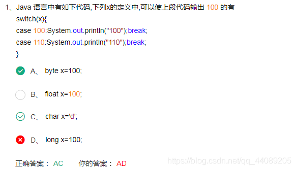
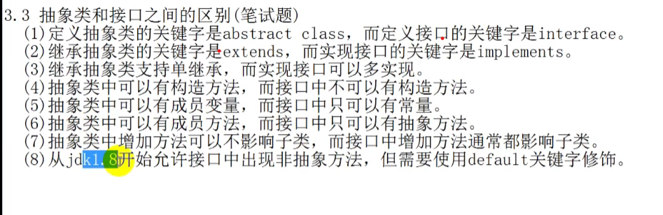
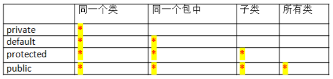

# Java面试题

## 1. Java基础
### 1.说说&和&&的区别

~~~
&和&&都可以用作逻辑与的运算符，表示逻辑与（and），当运算符两边的表达式的结果都为true时，整个运算结果才为true，否则，只要有一方为false，则结果为false。

&&还具有短路的功能，即如果第一个表达式为false，则不再计算第二个表达式。例如，对于if(str != null && !str.equals(s))表达式，当str为null时，后面的表达式不会执行，所以不会出现NullPointerException，如果将&&改为&，则会抛出NullPointerException异常。If(x==33 &++y>0) y会增长，If(x==33 && ++y>0)不会增长。

&还可以用作位运算符，当&操作符两边的表达式不是boolean类型时，&表示按位与操作，我们通常使用0x0f来与一个整数进行&运算，来获取该整数的最低4个bit位，例如，0x31 & 0x0f的结果为0x01。
~~~

### 2.switch语句中支持的变量类型

~~~
switch语句中支持的变量类型有 byte、short、int、char
从 Java SE 7 开始，switch语句支持字符串 String 类型了，同时 case 标签必须为字符串常量或字面量。
~~~

### 3.关于数据类型提升

~~~
对于short s1= 1; s1 = s1 + 1;由于s1+1运算时会自动提升表达式的类型，所以结果是int型，再赋值给
short类型s1时，编译器将报告需要强制转换类型的错误。

对于short s1= 1; s1 += 1;由于 +=是java语言规定的运算符，java编译器会对它进行特殊处理，因此
可以正确编译。
~~~

### 4.ceil、floor、round

~~~
ceil(向上取整)、floor（向下取整）、round（+0.5后再向下取整）
~~~

### 5.Overload和Override的区别？

~~~
子类覆盖父类的方法时，只能比父类抛出更少的异常，或者是抛出父类抛出的异常的子异常，因为子类可以解决父类的一些问题，不能比父类有更多的问题。子类方法的访问权限只能比父类的更大，不能更小。如果父类的方法是private类型，那么，子类则不存在覆盖的限制，相当于子类中增加了一个全新的方法。

在使用重载要注意以下的几点：
 1、在使用重载时只能通过不同的参数样式。例如，不同的参数类型，不同的参数个数，不同的参数
顺序（当然，同一方法内的几个参数类型必须不一样，例如可以是fun(int,float)，但是不能为
fun(int,int)）；
 2、不能通过访问权限、返回类型、抛出的异常进行重载；
 3、方法的异常类型和数目不会对重载造成影响；
 4、对于继承来说，如果某一方法在父类中是访问权限是priavte，那么就不能在子类对其进行重载，
如果定义的话，也只是定义了一个新方法，而不会达到重载的
~~~

### 6.抽象类与接口

~~~markdown
- 相同点
抽象类和接口均包含抽象方法，类必须实现所有的抽象方法 .
抽象类和接口都不能实例化，他们位于继承树的顶端，用来被其他类继承和实现.
- 两者的区别主要体现在两方面：语法方面和设计理念方面
语法方面的区别是比较 `低层次的，非本质的`，主要表现在：
接口中只能定义全局静态常量，不能定义变量。抽象类中可以定义常量和变量。
接口中所有的方法都是全局抽象方法。抽象类中可以有0个、1个或多个，甚至全部都是抽象方法。
抽象类中可以有构造方法，但不能用来实例化，而在子类实例化是执行，完成属于抽象类的初始化操作。接口中不能定义构造方法。
一个类只能有一个直接父类（可以是抽象类），但可以充实实现多个接口。一个类使用extends来继承抽象类，使用implements来实现接口。
- 二者的主要区别还是在设计理念上，其决定了某些情况下到底使用抽象类还是接口。
抽象类体现了一种继承关系，目的是复用代码，抽象类中定义了各个子类的相同代码，可以认为父类是一个实现了部分功能的“中间产品”，而子类是“最终产品”。父类和子类之间必须存在“is-a:继承”的关系，即父类和子类在概念本质上应该是相同的。
接口并不要求实现类和接口在概念本质上一致的，仅仅是实现了接口定义的约定或者能力而已。接口定义了“做什么”，而实现类负责完成“怎么做”，体现了功能（规范）和实现分离的原则。接口和实现之间可以认为是一种“has-a:组合的关系”
- IS-A、HAS-A和USE-A都是用来便是类与类之间的关系
IS-A表示继承。父类与子类，具有很高的耦合度。
HAS-A表示组合。是整体与部分的关系，同时它们的生命周期都是一样的。
USE-A表示依赖。依然是其中一个拥有另外一个，但是不负责销毁，也就是声明周期不一样。
~~~

### 7.静态内部类

### 8.异常

~~~
所有异常的根类java.lang.Throwble
~~~

### 9.Serializable接口

### 10.谈谈你对Spring的理解

~~~
1.Spring是实现了工厂模式的工厂类（在这里有必要解释清楚什么是工厂模式），这个类名为BeanFactory（实际上是一个接口），在程序中通常BeanFactory的子类ApplicationContext。Spring相当于一个大的工厂类，在其配置文件中通过元素配置用于创建实例对象的类名和实例对象的属性。

2. Spring提供了对IOC良好支持，IOC是一种编程思想，是一种架构艺术，利用这种思想可以很好地实现模块之间的解耦，IOC也称为DI（Depency Injection）。

3. Spring提供了对AOP技术的良好封装， AOP称为面向切面编程，就是系统中有很多各不相干的类的方法，在这些众多方法中要加入某种系统功能的代码，例如，加入日志，加入权限判断，加入异常处理，这种应用称为AOP。实现AOP功能采用的是代理技术，客户端程序不再调用目标，而调用代理类，代理类与目标类对外具有相同的方法声明，有两种方式可以实现相同的方法声明，一是实现相同的接口，二是作为目标的子类。
在JDK中采用Proxy类产生动态代理的方式为某个接口生成实现类，如果要为某个类生成子类，则可以用CGLIB。在生成的代理类的方法中加入系统功能和调用目标类的相应方法，系统功能的代理以Advice对象进行提供，显然要创建出代理对象，至少需要目标类和Advice类。spring提供了这种支持，只需要在spring配置文件中配置这两个元素即可实现代理和aop功能。
~~~

### 11.mybatis中#{},${}差异

~~~
#将传入的数据都当成一个字符串，会对传入的数据自动加上引号；
$将传入的数据直接显示生成在SQL中。
注意：使用$占位符可能会导致SQL注射攻击，能用#的地方就不要使用$，写order by子句的时候应该用$而不是#，还有like之后
~~~

### 12.八种数据类型及其字节数

### 13.i++与++i

~~~
共同点：
1、i++和++i都是变量自增1，都等价于i=i+1
2、如果i++,++i是一条单独的语句，两者没有任何区别
3、i++和++i的使用仅仅针对变量。 5++和++5会报错，因为5不是变量。
不同点：
如果i++,++i不是一条单独的语句，他们就有区别
i++ ：先运算后增1。++i:先加1，再运算
~~~

### 14.权限修饰符

### 15.继承条件下构造方法的执行过程

~~~
继承条件下构造方法的调用规则如下：
情况1：如果子类的构造方法中没有通过super显式调用父类的有参构造方法，也没有通过this显式调用自身的其他构造方法，则系统会默认先调用父类的无参构造方法。在这种情况下，写不写“super();”语句，效果是一样的。
情况2：如果子类的构造方法中通过super显式调用父类的有参构造方法，那将执行父类相应构造方法，而不执行父类无参构造方法。
情况3：如果子类的构造方法中通过this显式调用自身的其他构造方法，在相应构造方法中应用以上两条规则。
特别注意的是，如果存在多级继承关系，在创建一个子类对象时，以上规则会多次向更高一级父类应用，一直到执行
顶级父类Object类的无参构造方法为止。
~~~

### 16.==和equals的区别和联系

~~~
“==”是关系运算符，equals()是方法，同时他们的结果都返回布尔值；
“==”使用情况如下：
a) 基本类型，比较的是值
b) 引用类型，比较的是地址
c) 不能比较没有父子关系的两个对象 ==》编译器会提示报错

equals()方法使用如下：
a) 系统类一般已经覆盖了equals()，比较的是内容。
b) 用户自定义类如果没有覆盖equals()，将调用父类的equals（比如是Object），而Object的equals的比较是地址（return (this == obj);）
c) 用户自定义类需要覆盖父类的equals()
注意：Object的==和equals比较的都是地址，作用相同
~~~

### 17.Integer与int的区别

~~~
int是java提供的8种原始数据类型之一，Java为每个原始类型提供了封装类，Integer是java为int提供的封装类。int的默认值为0，而Integer的默认值为null，即Integer可以区分出未赋值和值为0的区别，int则无法表达出未赋值的情况，例如，要想表达出没有参加考试和考试成绩为0的区别，则只能使用Integer。在JSP开发中，Integer的默认为null，所以用el表达式在文本框中显示时，值为空白字符串，而int默认的默认值为0，所以用el表达式在文本框中显示时，结果为0，所以，int不适合作为web层的表单数据的类型。

在Hibernate中，如果将OID定义为Integer类型，那么Hibernate就可以根据其值是否为null而判断一个对象是否是临时的，如果将OID定义为了int类型，还需要在hbm映射文件中设置其unsaved-value属性为0。

另外，Integer提供了多个与整数相关的操作方法，例如，将一个字符串转换成整数，Integer中还定义了表示整数的最大值和最小值的常量。
~~~

### 18.java.sql.Date和java.util.Date的联系和区别

~~~
1）、java.sql.Date是java.util.Date的子类，是一个包装了毫秒值的瘦包装器，允许 JDBC 将毫秒值标识为 SQL DATE 值。毫秒值表示自 1970 年 1 月 1 日 00:00:00 GMT 以来经过的毫秒数。 为了与 SQL DATE 的定义一致，由java.sql.Date 实例包装的毫秒值必须通过将时间、分钟、秒和毫秒设置为与该实例相关的特定时区中的零来“规范化”。说白了，java.sql.Date就是与数据库Date相对应的一个类型，而java.util.Date是纯java的Date。 2）、JAVA里提供的日期和时间类java.sql.Date和java.sql.Timestamp,只会从数据库里读取某部分值，这有时会导致丢失数据。例如一个包含2002/05/22 5:00:57 PM的字段，读取日期时得到的是2002/05/22,而读取时间时得到的是5:00:57 PM. 你需要了解数据库里存储时间的精度。有些数据库，比如MySQL,精度为毫秒，然而另一些数据库，包括Oracle,存储SQL DATE类型数据时，毫秒部分的数据是不保存的。
以下操作中容易出现不易被发现的BUG：获得一个JAVA里的日期对象。 从数据库里读取日期 , 试图比较两个日期对象是否相等。如果毫秒部分丢失，本来认为相等的两个日期对象 , 用Equals方法可能返回false。.sql.Timestamp类比java.util.Date类精确度要高。
java.sql.Date 和 java.util.Date 最大的不同在于 java.sql.Date 只记录日期，而没有具体这一天的时间。所以举例来说，如果当前是2009-12-24 23:20，你创建一个 java.sql.Date 将只记下2009-12-24这个信息。若你需要保留时间进行JDBC操作，请使用 java.sql.Timestamp 代替。
总之，java.util.Date 就是Java的日期对象，而java.sql.Date 是针对SQL语句使用的，只包含日期而没有时间部
分。
~~~

### 19.代码规范差异对比

~~~java
//数据类型
Double i = 1D;
Double j = 1.0;
Double k = 1;// 开发工具提示报错
~~~

### 20.不通过构造函数也能创建对象吗？

~~~
Java创建对象的几种方式（重要）：
1、 用new语句创建对象，这是最常见的创建对象的方法。
2、 运用反射手段,调用java.lang.Class或者java.lang.reflect.Constructor类的newInstance()实例方法。
3、 调用对象的clone()方法。
4、运用反序列化手段，调用java.io.ObjectInputStream对象的 readObject()方法。
(1)和(2)都会明确的显式的调用构造函数 ；(3)是在内存上对已有对象的影印，所以不会调用构造函数 ；(4)是从文件
中还原类的对象，也不会调用构造函数。
~~~

### 21.在Java中，为什么基本类型不能做为HashMap的键值，而只能是引用类型，把引用类型做为HashMap的健值，需要注意哪些地方

~~~
在Java中是使用泛型来约束HashMap中的key和value的类型的，即HashMap<K, V>；而泛型在Java的规定中必须是对象Object类型的，也就是说HashMap<K, V>可以理解为HashMap<Object,Object>，很显然基本数据类型不是Object类型的，因此不能作为键值，只能是引用类型。虽然我们在HashMap中可以这样添加数据：“map.put(1,“Java”)；”，但实际上是将其中的key值1进行了自动装箱操作，变为了Integer类型。

引用数据类型分为两类：系统提供的引用数据类型（如包装类、String等）以及自定义引用数据类型。系统提供的引用数据类型中已经重写了HashCode()和equals()两个方法，所以能够保证Map中key值的唯一性；但是自定义的引用数据类型需要自己重写HashCode()和equals()这两个方法，以保证Map中key值的唯一性。
~~~

